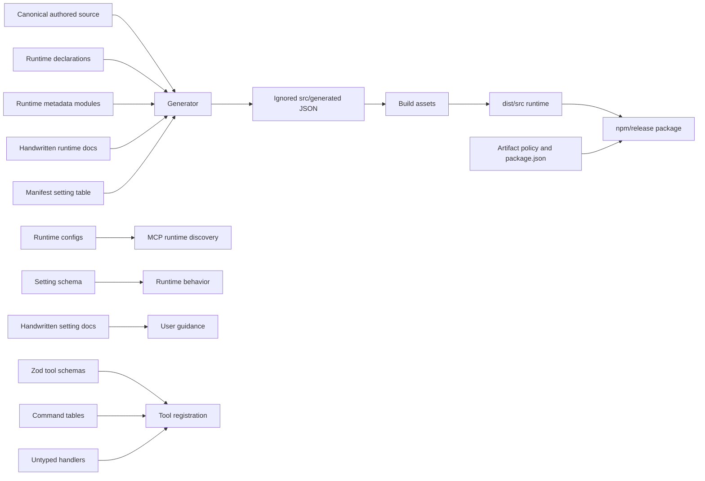
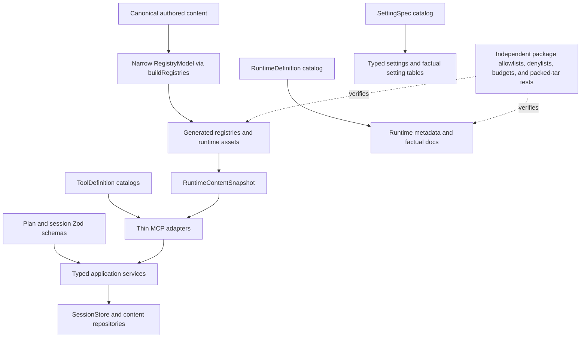

# Architectural Normalization and Codebase Reduction Analysis

**Audit date:** 2026-07-09

**Branch:** refactor/codebase_reduction

**Commit inspected:** 0b83bc05a8728c24648fd37ca84f9b5c549c1d02

**Scope:** tracked source, tests, generated/runtime surfaces, package contents, build and release tooling, and existing reduction reports

**Change made during the audit:** this report only; no runtime or generated output was changed

> **Implementation status (2026-07-11):** The approved normalization work was
> subsequently implemented on this branch. File paths, counts, and historical
> report names below describe the audited baseline; they are evidence for the
> recommendations, not a current inventory. Superseded reduction reports and
> temporary measurement artifacts were removed during merge preparation.

## Executive conclusion

The next reduction should not be another broad deletion pass. The highest-value work is to replace repeated facts and stage files with a small set of typed, canonical models from which build, runtime, documentation, package, and test projections are derived.

The present architecture has four recurring sources of bloat:

1. **Facts are canonical in more than one place.** Runtime topology, settings metadata, phase shapes, tool metadata, package paths, and documentation tables are independently maintained.
2. **Generated files are being used as intermediate source inputs.** This has produced a verified circular bootstrap: a tracked-only checkout cannot build because the build reads ignored files under src/generated, while the command that creates those files starts by building.
3. **TypeScript boundaries remain incomplete.** Zod schemas, handwritten shape checks, JSDoc types, explicit any, and untyped handler contracts coexist, so the same contract is expressed several times without end-to-end inference.
4. **Lifecycle plumbing is repeated.** Tests, CLI entry points, runtime discovery, content reads, session persistence, and build gates each repeat setup and projection logic.

The recommended target is:

- one narrow in-memory registry model, built through the existing registry-scanner seam, with no generated source-stage prerequisites;
- one pure RuntimeDefinition catalog;
- one enriched SettingSpec catalog;
- one typed descriptor for each of the existing 40 MCP tools;
- one typed session domain and repository boundary;
- one immutable runtime-content snapshot per server or provider lifetime; and
- small, transparent support primitives for tests and CLIs.

No aggregate structural line-reduction claim is evidence-backed before prototypes. The independently measured candidates are: 170–220 lines for replacing the custom schema layer, 460–710 lines across the broad test-normalization portfolio, 120–170 lines of CLI/package-root plumbing, and 150–250 lines of redundant type JSDoc after types improve. The four historical reports contain 2,946 gross lines; their net retirement depends on whether they are deleted or replaced with pointers. Normal builds can separately stop producing **188 declaration files / 4,542 generated lines / 187,470 bytes** that are explicitly excluded from the npm package.

Two correctness findings should precede reduction work:

- a tracked-only checkout currently fails npm run build because src/generated/resource-registry.json is ignored but required by build:assets; and
- MAESTRO_AUTO_ARCHIVE has a canonical default of false but is documented as true in multiple generated or authored surfaces.

## Evidence model and method

This report uses three evidence levels:

- **Observed:** read or executed against the commit named above.
- **Inferred:** a conclusion from the live call graph or duplication pattern, not yet demonstrated by an implementation or benchmark.
- **Product decision:** a valid reduction that changes a public or persisted contract and therefore requires explicit approval.

The audit:

- counted tracked files and lines with git ls-files and wc;
- grouped src, tests, Markdown, generated dist, and package contents separately;
- imported the built Zod schema maps to count the public MCP tools;
- used the TypeScript compiler API to count AnyKeyword syntax nodes;
- ran npm pack --dry-run --json --ignore-scripts with an isolated cache;
- reproduced a build from a git archive of HEAD with the existing node_modules linked in; and
- used parallel read-only subagents for architecture and source/test-boilerplate analysis, followed by adversarial audits of this written report.

Generated output, authored source, tests, historical reports, local build output, and shipped package contents are deliberately not mixed into one number. A change can reduce one while leaving the others unchanged.

## Current measured baseline

| Surface | Files | Lines | Bytes | Interpretation |
|---|---:|---:|---:|---|
| All tracked files | 519 | 62,128 | 2,436,092 | Includes source, tests, docs, and committed generated runtime output |
| Tracked src | 219 | 25,672 | 1,054,242 | Canonical runtime source plus authored content/assets |
| src TypeScript | 185 | 17,731 | 580,026 | Main executable source |
| src Markdown | 23 | 3,705 | 189,613 | Skills, references, templates, and runtime docs |
| Agent profile source | 1 | 3,867 | 269,166 | Deliberately dense compositional data, not boilerplate |
| Tests | 235 | 25,449 | 895,908 | Includes 44 JSON goldens |
| Handwritten tests excluding goldens | 191 | 24,442 | 874,763 | Primary test-boilerplate surface |
| JSON goldens | 44 | 1,007 | 21,145 | Independent expected data; should remain independent |
| Tracked Markdown, repository-wide | 50 | 10,558 | 529,594 | Includes generated/runtime docs and historical analysis |
| Four existing root reduction reports | 4 | 2,946 | 112,850 | Historical snapshots now overlapping this report |
| Local dist/src | 387 | 20,069 | 914,774 | Generated build output, not tracked authored source |
| Local declaration output | 188 | 4,542 | 187,470 | Excluded from the npm package |
| Ignored src/generated stage files | 3 | 704 | 15,424 | One observed build prerequisite plus downstream generation/runtime inputs |
| npm package dry run from prepared local workspace | 335 | n/a | 794,994 unpacked | 299,317 bytes packed; not reproducible from tracked HEAD until Finding 1 is fixed |

The largest tracked source subtrees are:

| Subtree | Lines | Bytes |
|---|---:|---:|
| src/mcp | 7,730 | 261,578 |
| src/tooling | 3,065 | 96,259 |
| src/platforms | 2,578 | 100,157 |
| src/generator | 1,752 | 58,933 |
| src/lib | 1,018 | — |
| src/core | 922 | — |
| src/hooks | 744 | — |

Additional observed signals:

- The public MCP surface contains **40 tools**: workspace 4, session 12, content 3, memory 15, and history 6.
- The TypeScript AST contains **726 explicit any syntax nodes across 89 files**. This is a syntax count, not a count of unsafe runtime defects.
- Type-oriented JSDoc blocks span approximately **1,377 lines across 72 TypeScript files**. Many comments contain useful behavioral constraints, so this is a ceiling, not a deletion target.
- package.json contains **52 explicit package entries**, including 22 dist/src allowlist entries. Broadening that allowlist would reduce manifest lines but weaken a useful independently authored package boundary.

## The architectural cause

The current flow has several parallel sources of truth:

The diagram exposes the reduction strategy: remove parallel fact stores and project from canonical typed data. The goal is not a universal framework. It is a small number of data descriptors at the seams where the repository already performs projection.

## Finding 1 — break the generated-input build cycle first

**Severity:** P0 correctness and reproducibility

**Evidence:** observed

A tracked-only source tree cannot complete npm run build.

Reproduction:

1. Exported HEAD with git archive into /tmp/maestro-audit-fresh-clone.rFNQyL.
2. Linked the existing node_modules so dependency installation was not part of the probe.
3. Confirmed that the exported tree had no src/generated directory.
4. Ran npm run build.

Observed result:

- build:code completed;
- build:assets failed with ENOENT for src/generated/resource-registry.json; and
- the process exited with status 1.

The cycle is directly visible:

- .gitignore:68 ignores /src/generated/.
- src/tooling/copy-runtime-assets.ts:83-85 reads JSON assets from src.
- src/tooling/copy-runtime-assets.ts:131-155 constructs the runtime content registry and reads generated/resource-registry.json.
- src/tooling/generate.ts:119-125 creates a generation session and writes registry outputs.
- package.json:22 defines generate as build followed by the generator.
- src/generator/content-file-emitter.ts:35-36 reads generated/agent-registry.json as another generation input.
- src/core/agent-registry.ts:10-13 and src/mcp/content/runtime-content.ts:10-24 consume the generated registries at runtime.

The existing build contract test does not catch this. tests/unit/typescript-build-contract.test.js:17-29 copies the live workspace while excluding .git, node_modules, and dist, but it does not exclude ignored src/generated. Its build assertion at lines 64-68 therefore inherits local stage files.

### Target design

Strengthen the existing in-memory registry seam rather than introduce a repository-wide generation aggregate:

- src/generator/registry-scanner.ts:116-137 already builds and serializes the registries;
- src/generator/cross-reference-validator.ts:69-77 already consumes buildRegistries directly;
- define a narrow typed RegistryModel around those values;
- pass that model to content emission and runtime-asset assembly;
- write source-visible or dist-visible projections only as final outputs; and
- remove src/generated as an inter-stage prerequisite.

Tool descriptors, session schemas, runtime content caching, and package safety policy are not inputs to this model. The compiler can still produce the generator and asset assembler first. The assembled code then derives registries from tracked source and emits final assets in a defined sequence. No build step should require a file that only a later public command creates.

Add a real tracked-tree contract test based on git archive, or an explicit tracked-file allowlist. Copying the developer workspace is insufficient for this invariant.

The adversarial audit proved a narrower fact: resource-registry.json alone blocks npm run build. agent-registry.json and hook-registry.json are downstream generation/runtime inputs, but adding only resource-registry.json to the tracked-only probe allowed the build to complete. The likely net LOC change is unknown; the main gain is deterministic clean-checkout behavior and removal of hidden stage state.

## Finding 2 — generate setting surfaces from one enriched descriptor

**Severity:** P0 contract drift

**Evidence:** observed

MAESTRO_AUTO_ARCHIVE is contradictory:

- src/config/settings-schema.ts:24 declares the canonical default as false.
- src/platforms/shared/runtime-context-template.md:56 says true.
- src/skills/shared/session-management/SKILL.md:203 says true by default.
- src/references/orchestration-steps.md:164 treats true or unset as archive.
- docs/architecture.md:372 and docs/usage.md:72 say true.

The duplication is structural:

- src/config/settings-schema.ts:8-31 owns ten names, schemas, and defaults.
- src/platforms/metadata-shared.ts:81-118 separately handwrites seven setting labels/descriptions.
- src/mcp/handlers/resolve-settings.ts:5-25 validates a coerced value but returns the original raw string or null, rather than the typed effective value including the declared default.

### Target design

Extend SettingSpec with stable presentation fields:

- name and environment variable;
- Zod schema;
- default;
- label and description;
- documentation/public visibility; and
- optional formatting guidance.

Project extension manifests, runtime-context tables, architecture/usage setting tables, known-setting lists, and resolve_settings output from that descriptor. resolve_settings should either expose a clearly named raw view and an effective typed view, or return typed effective values consistently.

The product team must decide whether auto-archive is actually false or true. Preserving the canonical false value is the least surprising implementation assumption, but this report does not silently choose behavior.

## Target architecture

Dependency direction should be:

1. pure contracts and descriptors;
2. domain/application services;
3. filesystem and SDK adapters;
4. generators, packaging, and CLI entry points.

Tooling may consume runtime definitions; runtime definitions must not import tooling policy. RuntimeDefinition may project runtime-specific positive facts, but package allowlists, denied paths, budgets, and packed-tar assertions must remain independently authored so the system does not validate itself. Repositories must own persistence; repositories must not re-export handler implementations.

## Ranked opportunity portfolio

Only ranges backed by directly measured duplicate or removable code are shown. Structural rows are marked TBD because stronger types and replacement projection code may initially add lines; they require a prototype diff before entering any aggregate target.

| Priority | Opportunity | Primary outcome | Estimated net tracked reduction | Confidence |
|---|---|---|---:|---|
| P0 | Narrow RegistryModel through buildRegistries | Fix clean-checkout build; remove hidden stage dependency | TBD; removes hidden stage state | High on defect |
| P0 | Enriched setting descriptor | Eliminate contradictory defaults and hand-maintained tables | 40–100 lines | High |
| P1 | Pure RuntimeDefinition catalog | Normalize runtime-specific metadata, startup, output, and factual docs | TBD pending prototype | High on duplication, low on net size |
| P1 | Zod-only validation stack | Remove custom schema DSL and infer setting/registry types | 170–220 lines | High |
| P1 | Typed tool descriptors | Join name, schema, metadata, handler, and workspace policy | TBD pending prototype | High on typing need, low on net size |
| P1 | Typed session domain and repository | Correct dependency direction; dedupe only measured state construction | TBD pending prototype | High on dependency issue, low on net size |
| P1 | RuntimeContentSnapshot | Avoid repeated read/decompress/materialize work | LOC TBD; performance unbenchmarked | High on repeated work |
| P2 | Broad test-normalization portfolio | Normalize lifecycle mechanics plus selected fixtures/assertion matrices | 460–710 lines; mechanics subset 270–395 | Medium-high |
| P2 | CLI and package-root primitives | Replace handwritten parsers and ancestor walks | 120–170 lines | High |
| P2 | Pure workspace-path primitives | Remove core-to-MCP/platform inversion and duplicate candidate parsing | TBD pending prototype | High on dependency issue |
| P2 | TypeScript-only data modules | Remove allowJs exceptions and source/dist config probing | 40–80 lines | Medium |
| P2 | Parser and alias cleanup | Remove duplicate frontmatter path and pure facades | 100–220 lines | Medium |
| P2 | Redundant type JSDoc after typing | Remove duplicated signatures, preserve rationale | 150–250 lines | Medium |
| P2 | Lifecycle-aware leaf scripts | Compile once per intentional verification boundary | Primarily latency, not LOC | High on duplication |
| P3 | Retire superseded root reports | Reduce historical tracked prose; Git retains history | 2,946 gross lines; net policy-dependent | High, policy decision |
| Separate decision | Registry-only runtime content | Delete filesystem fallback after compatibility review | Measure separately from caching | Medium |
| Separate | Disable normal declaration emission | Reduce local output by 188 files / 4,542 lines | 0 tracked/package lines | High |

## Opportunity details

### 3. Define each runtime once

The core runtime descriptor/metadata subset is **14 files / 1,277 lines**. A broader projection cluster that also includes artifact policy, release manifest, package.json, and four runtime docs is **21 files / 2,886 lines**. Runtime facts are repeated among:

- src/platforms/runtime-declarations.ts;
- src/platforms/runtime-descriptor.ts;
- src/platforms/runtime-payload-contract.ts;
- src/platforms/metadata.ts and metadata-shared.ts;
- four runtime-config.ts files;
- four runtime metadata modules;
- src/generator/generated-surface-inventory.ts;
- src/tooling/artifact-policy.ts and release-artifact-manifest.ts; and
- package.json and per-runtime runtime-doc.md files.

src/platforms/runtime-declarations.ts:1 imports src/tooling/artifact-policy.ts, placing a platform contract above a tooling implementation. Runtime configuration is also discovered through filesystem scans and dynamic imports in src/mcp/runtime/runtime-config-map.ts:8-20, while metadata and descriptors contain separate loaders.

Use a static, pure RuntimeDefinition registry for names, startup topology, content strategy, runtime-specific output paths, feature flags, and factual documentation. Metadata and generator consumers should project these positive runtime facts from it.

Keep package.json’s allowlist, artifact-policy denials, leakage patterns, size budgets, and packed-tar tests independently authored. Deriving the safety oracle from the same catalog as the outputs would make package validation self-confirming.

Do not create one lowest-common-denominator mega-object. Retain runtime-specific render functions for Claude, Codex, and the Gemini family. The catalog should centralize facts, not erase real host differences.

### 4. Replace the custom schema DSL with Zod

src/lib/schema/index.ts is 138 lines. Its practical consumer set is settings resolution and generated-registry validation, while Zod is already a production dependency and already defines MCP inputs.

Replace it with:

- Zod preprocessors for environment booleans, integers, CSV, and strings;
- inferred TypeScript types;
- one adapter that maps Zod issues to the existing ValidationError shape; and
- regression tests for exact coercion and error behavior.

This can retire the custom module, its dedicated 108-line test, and its package allowlist entry. Do not weaken error messages or silently change accepted environment spellings.

### 5. Join MCP schema, metadata, and handler types

The 40 tools are currently distributed across five index modules, five schema maps, command-table.ts, contracts.ts, handlers, and a separate workspace requirement registry. Session, memory, and history descriptors repeat requiresWorkspace: true for nearly every entry.

A descriptor should resemble a data declaration:

- public name and description;
- input Zod schema;
- handler with arguments inferred from that schema;
- workspace policy, preferably inherited as a pack default; and
- optional runtime/post-call policy.

The registration adapter can then generate the SDK registration, workspace gate metadata, catalog tests, and documentation projections. Runtime parity checks between independently keyed maps become unnecessary because the keys are no longer independent.

Preserve the 40 named tools. Collapsing them into five action routers is not a code-reduction architecture: handlers and schemas remain, dispatch code is added, and model tool selection becomes less explicit.

This is a type-safety and normalization direction, not yet a measured deletion. Prototype one pack and compare gross additions/deletions before assigning a repository-wide LOC target.

### 6. Complete the session-layer boundary

The current session cluster is approximately 1,843 lines. Its dependency direction is inverted:

- src/mcp/session/session-repository.ts:4-15 imports handler implementation and largely re-exports it;
- src/mcp/session/document-repository.ts:4-8 imports a handler input module;
- src/mcp/session/session-lifecycle-service.ts:5-16 imports design-gate, analytics, migration, and attempt helpers from handlers;
- src/mcp/session/phase-transition-service.ts:10-12 imports checkpoints, blockers, and session-state-core from handlers; and
- src/mcp/handlers/session-state-tools.ts is a 21-line alias façade used by the tool pack and one test.

There are also multiple initial/default/reset phase shapes, including session-lifecycle-service.ts:56-75 and session-state-core.ts:113-126.

Create typed SessionState, PhaseState, PhaseId, TokenUsage, and DownstreamContext schemas/types. Let one SessionStore own parse, migrate, validate, read, and atomic write. Put state transitions in pure application functions or compact services, and make MCP handlers thin adapters.

Avoid an interface/class hierarchy for every operation. Structural TypeScript service contexts and small pure functions fit this repository better. Event sourcing or SQLite should not be justified as bloat reduction: either would initially add events, projections, migrations, and compatibility code.

The directly verified deletion is limited to the 21-line alias façade and portions of the repository re-export layer. Lifecycle and transition behavior must remain. Therefore the net reduction is TBD until a prototype inventories duplicate phase/default builders and measures replacement types and store code.

### 7. Make one plan/phase schema canonical

The phase contract appears in src/mcp/tool-packs/zod-fragments.ts:20-28, src/mcp/contracts/plan-schema.ts, session creation logic, and src/mcp/validation/schema-checker.ts.

Define one Zod PhaseInputSchema and PlanSchema, infer types, and adapt Zod issues to the current validation rule codes. Preserve any intentionally permissive phase-ID wire behavior until a separately approved contract change.

This work belongs with the tool/session typing phases and should not be counted twice.

### 8. Load runtime content once per lifetime

src/mcp/content/runtime-content.ts repeatedly:

- reads/parses the registry at lines 178-195;
- reads and gunzips the complete payload at lines 197-220 and 223-250; and
- materializes the complete agent-profile set before finding one agent at lines 335-374.

Batched get_skill_content and get_agent calls create a provider and loop over items, so the repeated registry and payload operations occur within a single request. This is observed in src/mcp/handlers/get-skill-content.ts:25-42 and get-agent.ts:26-52.

Build one indexed RuntimeContentSnapshot per provider invocation as a low-risk first step, or per server lifetime if runtime content is immutable after startup. Use typed filesystem and registry adapters behind the same read(kind, id) contract.

The likely I/O and CPU improvement is inferred from the call graph; no performance percentage should be claimed until a benchmark measures cold startup, one lookup, and a multi-item batch. Caching may add lifecycle/index code, so its LOC effect is TBD.

Removing production filesystem fallback is a separate compatibility decision that could delete more code, but only after source-authoring and generator tests have explicit adapters. Measure it separately; do not include fallback deletion in the snapshot estimate.

### 9. Stop producing declarations that are never shipped

tsconfig.json:9 enables declaration output. package.json:120-121 explicitly excludes declaration files and maps. The current local build emits 188 .d.ts files totaling 4,542 lines and 187,470 bytes.

Normal builds should set declaration to false. If a public type surface is intended, add a separate emitDeclarationOnly API-contract gate. tests/fixtures/mcp-command-table-type-contract.ts and tsconfig.type-tests.json already provide a source-level type contract; tests/unit/typescript-build-contract.test.js:83-103 should stop requiring unused build artifacts.

This is a local build file/time reduction, not a tracked source or published-package reduction.

### 10. Normalize CLI and path primitives

Package-root ancestor walking is repeated in:

- src/tooling/lib/cli.ts:17-39;
- src/bin/maestro-mcp-server.ts:12-31;
- src/bin/maestro-install-codex.ts:28-47; and
- similar logic in src/core/version.ts.

Move the reusable resolver into shipped core code so bins and tooling can consume it without importing private tooling.

Several entry points also handwrite argument loops. Replace them with node:util.parseArgs while keeping each command’s option declaration local. This is simpler than a custom CLI framework.

Repeated moduleFilename/moduleDirname declarations appear in tooling and tests. Because package.json supports Node >=20 rather than a specific minor that guarantees import.meta.dirname, use a tiny compatibility helper unless the engine floor is intentionally raised.

### 11. Move workspace-path ownership into pure core

src/core/project-root-resolver.ts:5-7 currently imports an MCP cache-path contract and a platform RuntimeConfig type. That reverses the intended dependency direction. It also repeats environment, client-root URI, existence, and placeholder parsing found in src/mcp/server/project-root-cache.ts:30-58.

Create a pure core workspace-path candidate module that owns file-URI parsing, placeholder rejection, existence checks, and candidate normalization. Move cache-path classification below or alongside that core boundary. Both the runtime resolver and MCP cache should consume it while retaining their distinct policies: one resolves a root, the other only suggests until initialize_workspace makes the path authoritative.

This is a verified dependency and duplication seam, but the net LOC is TBD until the two callers are refactored.

### 12. Complete the TypeScript-only executable plane

tsconfig.json:7-8 keeps allowJs/checkJs behavior, and the include list at lines 23-26 admits three JavaScript data modules:

- src/manifest.js;
- src/entry-points/registry.js; and
- src/entry-points/core-command-registry.js.

Convert them to typed data modules using satisfies, keep NodeNext .js import specifiers, and remove allowJs. src/platforms/runtime-descriptor.ts:151-169 and src/tooling/generate.ts:25-31 also carry source-versus-dist probing; once generation consistently executes compiled code, remove that branching.

This is a bounded normalization rather than a general rewrite. Preserve source-first authoring and committed generated runtime outputs.

### 13. Normalize the test portfolio without erasing test meaning

The test audit found:

- six environment save/override/restore implementations occupying 126 lines;
- 81 mkdtempSync calls in 50 files;
- 88 recursive forced cleanup calls in 44 files;
- 36 ESM moduleFilename declarations and 35 moduleDirname declarations;
- three exact stdio server lifecycle wrappers plus one specialization;
- ten in-memory MCP transport-pair constructions across seven files; and
- overlapping artifact/package assertion matrices.

Recommended transparent support:

- withEnv(overrides, fn);
- per-test makeTempDir and writeFixtureFile helpers;
- a path/root compatibility helper;
- withStdioServer and low-level withConnectedPair; and
- small domain-specific fixture builders and tables where only input/expectation data varies.

Keep full npm pack/install/bin smoke tests, release archive verification, security-critical exclusions, and independent corruption encoders. Do not generate the 44 golden files from the schemas they test. Do not hide semantic scenarios behind a universal fixture DSL.

The directly supported lifecycle/mechanics subset is approximately 270–395 lines. A safer first tranche is 200–280 lines from exact environment, path, lifecycle, and transport duplication. The broader 460–710-line portfolio also includes medium-risk package assertion-matrix consolidation and domain fixture tables; it must not be presented as uniformly low-risk helper extraction.

### 14. Retire aliases and duplicate parsers selectively

Verified small seams include:

- src/tooling/lib/artifact-inventory.ts, a 12-line re-export used only by a substantially overlapping test;
- src/mcp/handlers/session-state-tools.ts, a 21-line alias façade;
- src/lib/frontmatter/index.ts:184-216, parseFrontmatterOnly, with one production consumer;
- src/mcp/content/runtime-content.ts:104-125, a second handwritten inline-array/frontmatter interpretation path; and
- duplicate imports and package parsing in a handful of tests.

Use the rich canonical frontmatter parser and keep delimiter/escaping tests there. Before removing parseFrontmatterOnly, prove that the richer parser preserves the runtime metadata semantics rather than deleting “compatibility” tests by assertion.

### 15. Remove redundant type narration only after types carry it

The repository has substantial type-oriented JSDoc inside .ts files. Some is redundant with signatures; some records security, ordering, or compatibility constraints that types cannot express.

Sequence matters:

1. infer handler inputs from Zod descriptors;
2. introduce session/domain types;
3. run strict type checking;
4. remove only duplicate @param, @returns, @type, and @typedef narration; and
5. retain rationale and failure-contract comments.

A safe estimate is 150–250 lines, not the full 1,377-line span of blocks containing type tags.

### 16. Make composite build gates lifecycle-aware

package.json:22-40 shows:

- check:source invokes generate, which builds, then test, which builds again;
- check:release invokes three children, each of which starts with a build; and
- prepack invokes generate, which starts with a build.

Create build-owning public gates and build-free leaf commands such as test:run and release:*:run, but account for npm lifecycle recursion. src/tooling/verify-npm-pack.ts:57 launches npm pack with scripts enabled; prepack at package.json:40 invokes generate and therefore another build.

Use two explicit paths:

- an already-generated/built composite verifier may pack with --ignore-scripts to avoid rebuilding; and
- at least one standalone package lifecycle smoke must keep scripts enabled so prepack and the real publication path remain tested.

The goal is one compilation per intentional lifecycle boundary, not an absolute one-build run. This is primarily latency and CI clarity, not material source reduction. Measure wall-clock time before and after; do not infer a percentage from command nesting.

### 17. Consolidate historical analysis after the new report is accepted

These four reports total 2,946 tracked lines:

- CODEBASE_REDUCTION_OPTIONS.md;
- CODEBASE_REDUCTION_FURTHER_OPTIONS.md;
- CODEBASE_REDUCTION_DEEP_DECISION_REPORT.md; and
- BREAKING_REDUCTION_PROTOTYPES.md.

They represent useful history, but Git already preserves it and several measurements predate the current TypeScript/dist-src architecture. Once this report is accepted as canonical, either delete them or replace them with short pointers to this report and the relevant commits.

This is a documentation-policy change, not implementation, so no historical report was deleted during this audit.

## Reductions that require explicit product approval

These are real reductions but not safe architectural normalization:

1. **Remove maestro-install-codex.** The legacy/offline bin is approximately 219 source lines plus direct integration coverage and documentation. Deleting it breaks a public command and offline path.
2. **Remove source-checkout MCP wrapper files.** This requires changing local Claude/plugin assembly and breaks direct wrapper entry points.
3. **Retire old session migrations.** This breaks persisted-state compatibility.
4. **Drop a runtime family.** This is the largest genuine surface reduction, but it is a product-support decision.
5. **Narrow the 40-tool public API.** Tool deletion can remove code; action-router renaming alone cannot.
6. **Raise the Node engine floor.** This could remove compatibility helpers but changes supported environments.

Each should have a separate decision record, migration statement, and release-note plan.

## Attractive ideas to reject as reduction strategies

- **Five action routers instead of 40 tools:** does not remove handlers or schemas and adds a dispatcher.
- **Event sourcing or SQLite for sessions:** may solve future persistence needs but increases code until old state formats are intentionally dropped.
- **A general dependency-injection container:** replaces direct structural dependencies with registration boilerplate.
- **Decorators or a generic state-machine framework:** accept only if a prototype proves a net deletion and preserves debuggability.
- **Generating goldens from production schemas:** makes validation tests tautological.
- **Broad dist/src package inclusion:** saves manifest lines by weakening leakage controls.
- **Removing real package/release tests:** reduces tests at the cost of the only end-to-end contract evidence.
- **A bundler solely for size:** may reduce published file count, but tar gzip already compresses the package and tracked source remains.
- **Splitting content into another package:** can reduce one consumer footprint while increasing repository, release, and versioning surface.
- **Flattening runtime-specific behavior:** creates conditionals and obscures real host differences.

## Seams to preserve

The audit found several existing abstractions that are already the correct kind:

- src/core/agent-sources.ts composes the large profile into agent sources;
- src/platforms/shared/gemini-family-config.ts captures a real runtime family;
- src/platforms/shared/adapters/factory.ts centralizes shared adapter behavior;
- src/lib/io contains atomic file primitives;
- tests/support/mcp.js provides an SDK-backed MCP harness;
- explicit package allowlists protect the runtime boundary; and
- independent golden and corruption fixtures protect against self-confirming tests.

Reduction work should extend these seams rather than replace them.

## Adversarial subagent audit record

Three independent read-only reviews examined this exact report after the first draft. The reviewers did not edit the file.

1. **Architecture reviewer:** verified the two P0 findings, then rejected the original repository-wide GenerationModel as over-broad; identified the existing buildRegistries seam; required package safety policy to remain independent; challenged the session/tool LOC estimates; and found the missing workspace-path and TypeScript-only seams.
2. **Metrics reviewer:** recomputed tracked, source, test, Markdown, dist, declaration, package, tool, any, and JSDoc counts; repeated the tracked-tree build probe; proved that resource-registry.json alone blocks build; and rejected the draft’s aggregate structural reduction range and ambiguous runtime-cluster count.
3. **Test/package reviewer:** verified the test and package counts and the preservation guardrails; identified npm prepack recursion in the “compile once” proposal; required authoritative source/release gates; distinguished lifecycle-only savings from the broader test portfolio; and corrected the runtime-output oracle from nonexistent goldens to committed-output zero-diff plus contract tests.

Corrections applied from those audits:

- narrowed generation to a RegistryModel around the existing registry scanner;
- separated runtime, setting, tool, session, content, and package-safety ownership;
- removed unsupported net estimates for runtime, tool, session, caching, and workspace redesigns;
- qualified package metrics as prepared-local-workspace observations;
- separated caching from filesystem-fallback deletion;
- preserved independently authored package allowlists, denials, budgets, and packed-tar assertions;
- added workspace-path and remaining JavaScript-data-module opportunities;
- changed build optimization to one compile per intentional lifecycle boundary;
- strengthened phase gates to the repository’s authoritative source and release checks; and
- retained the independently verified P0 findings unchanged.

No reviewer found a material P0 error after rechecking the evidence. After the corrections, all three reviewers re-read the final draft and returned clean verdicts with no unresolved or new P0/P1 findings. The remaining numeric ranges in the opportunity table are limited to directly measured duplicate/removable surfaces or explicitly marked TBD.

## Phased implementation sequence

### Phase 0 — reproducible baseline and accounting

1. Add the tracked-only build test.
2. Record the baseline metrics in a machine-readable artifact.
3. Add separate counters for tracked authored lines, committed generated lines, local dist files, packed/unpacked package bytes, tool count, and test count.
4. Ensure each later phase reports gross additions, gross deletions, and net change.

**Pre-change reproduction, not a completed checkpoint:** write or stage the tracked-only test and observe it fail for the resource-registry ENOENT. Do not land a red Phase 0 checkpoint; carry the test into Phase 1 and make it pass.

### Phase 1 — fix generation bootstrap and setting drift

1. Define the narrow RegistryModel around buildRegistries and remove src/generated as an input stage.
2. Make build, generation, content emission, and runtime-asset assembly consume registry values directly.
3. Enrich SettingSpec and generate factual setting surfaces.
4. Resolve the auto-archive product default explicitly.

**Gate:** git-archive tracked tree can build; current full tests pass; generation has zero drift; package dry-run metrics remain within an intentional delta.

### Phase 2 — canonical runtime catalog

1. Move runtime facts into pure RuntimeDefinition data.
2. Make metadata, generator inventory, and factual runtime docs project positive runtime facts from it.
3. Preserve runtime-specific renderers.
4. Remove filesystem/dynamic runtime discovery where a static catalog is authoritative.
5. Keep package allowlists, denials, budgets, and packed-tar verification independent.

**Gate:** all four runtime artifacts and local plugin layouts match committed generated outputs under zero-diff, and runtime/package contract tests pass. Add independent fixtures only where committed output is not a sufficient oracle.

### Phase 3 — typed contracts

1. Replace the custom schema DSL with Zod.
2. Define canonical plan/session schemas.
3. Join tool descriptors and infer handler arguments.
4. Move session persistence into SessionStore and correct dependency direction.
5. Move workspace-path parsing into pure core and remove the core-to-MCP/platform inversion.
6. Convert the three JavaScript data modules to TypeScript and remove source/dist probing where compiled execution is authoritative.
7. Remove redundant JSDoc and alias façades only after strict type checks.

**Gate:** typecheck and type-contract fixtures pass; all 40 tool names and input contracts are unchanged unless separately approved; migration fixtures still load.

### Phase 4 — content and mechanical normalization

1. Add RuntimeContentSnapshot and benchmark it.
2. Add transparent test lifecycle helpers and migrate repeated mechanics.
3. Normalize package-root and CLI parsing.
4. Consolidate frontmatter parsing and exact duplicate tests.
5. Add lifecycle-aware leaf scripts while preserving one scripts-enabled package smoke.

**Gate:** behavior tests remain semantically explicit; cold startup and batch lookup are measured; composite gates compile once per intentional lifecycle boundary.

### Phase 5 — output and historical cleanup

1. Disable declaration output in normal builds or move it to a dedicated API gate.
2. Retire superseded root reduction reports after this report is accepted.
3. Evaluate breaking deletions one at a time with explicit approval.

**Gate:** npm package surface, bins, runtime startup, release archives, and source-checkout workflows pass.

## Required verification for every implementation phase

For every code-changing phase, at minimum:

- npm run typecheck
- npm run typecheck:type-tests
- just ci or the authoritative npm run check:source equivalent
- tracked-only build test

Generator/build phases also require npm run build, npm run generate, and a clean generated-output diff. Runtime/content phases need direct MCP initialize, tools/list, and representative tools/call probes. Package or release phases require just release-check or npm run check:release, package file/byte comparison, actual packed-tar install/bin startup, and archive verification. Keep one scripts-enabled npm pack path to exercise prepack; an already-built comparison path may use --ignore-scripts. Performance claims require before/after timing with the same cold/warm conditions.

## Success criteria

The program is successful when:

- a tracked-only checkout builds without hidden local files;
- every setting, runtime, tool, and phase fact has one named canonical owner;
- generated and documentation projections are derived from those owners;
- MCP handlers receive inferred input types rather than broad any;
- session repositories own persistence and handlers remain adapters;
- content registries and payloads are read once per declared lifetime;
- normal builds no longer emit unused declaration artifacts;
- the complete test/package/release safety layers remain; and
- each phase demonstrates a measured net reduction instead of moving lines between layers.

The desired end state is not “fewest possible files.” It is fewer independent facts, fewer hidden stages, thinner adapters, and a codebase whose generated and shipped surfaces can be explained from a small typed core.
