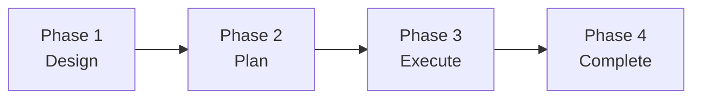
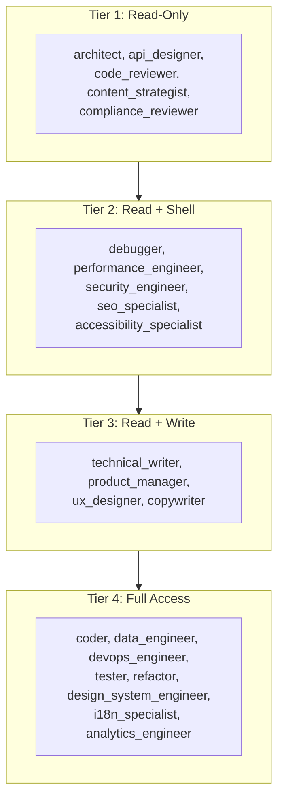
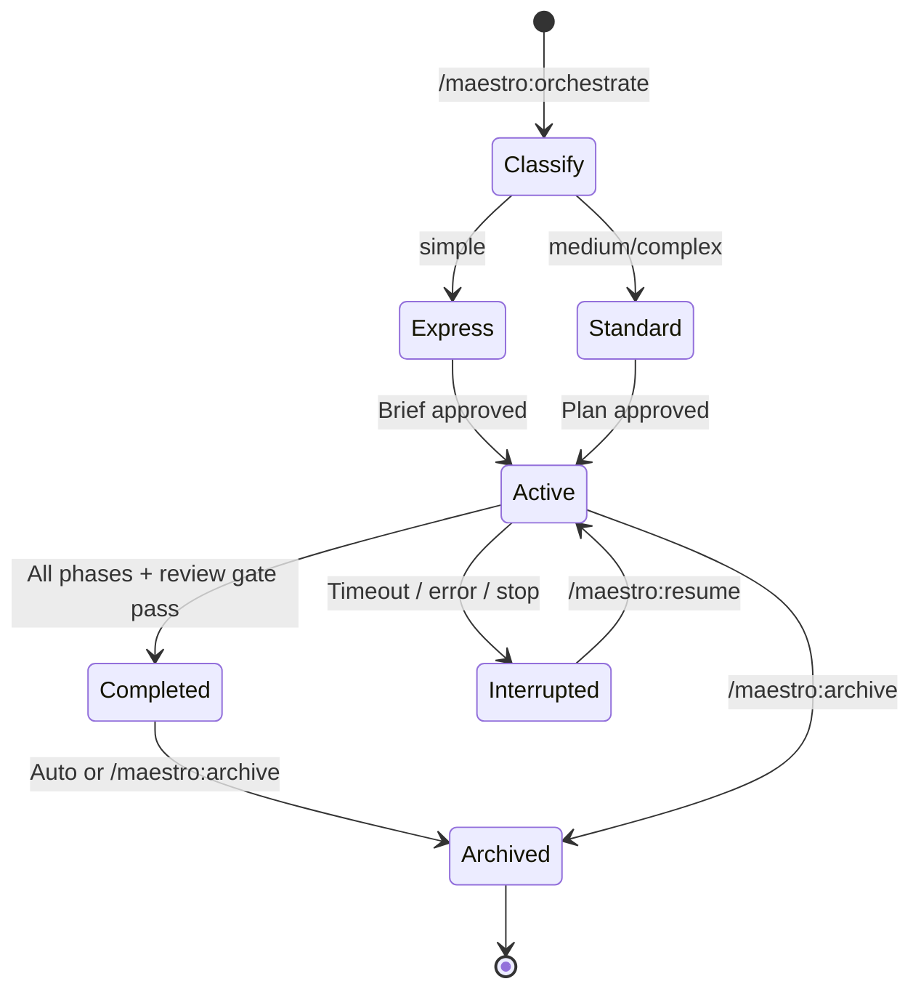

# Maestro Overview

A high-level explanation of how Maestro works, its agent system, and execution model. For installation and command details, see the [README](README.md). For a comprehensive walkthrough, see the [Usage Guide](USAGE.md).

## How It Works

Maestro is a multi-agent orchestration platform for **Gemini CLI** and **Claude Code**. It introduces a TechLead orchestrator persona that coordinates 22 specialized subagents through structured workflows. The orchestrator does not implement code directly -- it designs, plans, delegates, validates, and reports. The same orchestration engine, agents, and quality gates run on both platforms.

When you invoke `/maestro:orchestrate`, Maestro classifies the task by complexity and routes it to the appropriate workflow:

- **Simple tasks** enter the Express workflow: a streamlined inline flow with 1-2 clarifying questions, a consolidated brief, single-agent delegation, code review, and archival.
- **Medium and complex tasks** enter the Standard workflow: a full 4-phase lifecycle (Design, Plan, Execute, Complete) with multi-agent delegation, parallel execution support, and iterative quality gates.

The orchestrator maintains session state throughout, enabling resumption after interruptions, progress tracking, and structured archival of completed work.

## Workflow Modes

### Express Workflow

Express mode is designed for simple, focused tasks -- single-concern changes that affect a handful of files. It collapses the Standard workflow's ceremony into a minimal flow:

1. **Clarify**: 1-2 questions about problem scope, combining or skipping sub-questions already answered by the task description
2. **Brief**: A single structured approval prompt presenting the problem, approach, alternative considered, file manifest, agent assignment, and validation command
3. **Execute**: Single-agent delegation with full protocol injection
4. **Review**: `code_reviewer` validates the output; Critical/Major findings get one retry
5. **Archive**: Session state archived; no design document or implementation plan exists to move

Express bypasses the execution mode gate and always dispatches sequentially. If the user rejects the brief twice, Maestro escalates to Standard workflow.

### Standard Workflow

The Standard workflow is a 4-phase lifecycle for medium and complex tasks:

Each phase has defined entry criteria, user approval checkpoints, and produces artifacts that feed the next phase. The orchestrator activates specialized skills for each phase, keeping the base context lean.

### Complexity Classification

Before entering any workflow, Maestro classifies the task using heuristics based on scope, example patterns, and codebase characteristics:

| Signal | Simple | Medium | Complex |
|--------|--------|--------|---------|
| Scope | Single concern, few files | Multi-component, clear boundaries | Cross-cutting, multi-service |
| Greenfield | Empty or near-empty repo | Small existing codebase | Large codebase with established patterns |
| Downstream behavior | Express workflow, 3 phase max, engineering domain only | Standard workflow, 5 phase max, engineering + relevant domains | Standard workflow, no phase cap, full 8-domain sweep |

The classification is always presented to the user with rationale, and the user can override it.

## Agent System

### Roster by Domain

Maestro coordinates 22 agents across 8 editorial domains. The domain analysis during planning determines which domains are relevant, proportional to task complexity:

**Engineering** (12 agents): architect, api_designer, coder, code_reviewer, data_engineer, debugger, devops_engineer, performance_engineer, refactor, security_engineer, tester, technical_writer. These agents cover system design, implementation, testing, infrastructure, security, and documentation.

**Product** (1 agent): product_manager. Handles requirements gathering, PRDs, and feature prioritization. Engaged when requirements are unclear or success depends on user outcomes.

**Design** (3 agents): ux_designer, accessibility_specialist, design_system_engineer. Cover user flow design, WCAG compliance, and design token/theming architecture. Engaged when the deliverable has a user-facing interface.

**Content** (2 agents): content_strategist, copywriter. Cover content planning, editorial strategy, persuasive copy, and brand voice. Engaged when the task produces or modifies user-visible text.

**SEO** (1 agent): seo_specialist. Covers technical SEO audits, schema markup, and crawlability. Engaged when the deliverable is web-facing and needs search engine discoverability.

**Compliance** (1 agent): compliance_reviewer. Covers GDPR/CCPA auditing, license checks, and data handling practices. Engaged when the task handles user data, payments, or operates in a regulated domain.

**Internationalization** (1 agent): i18n_specialist. Covers string extraction, locale management, and RTL support. Engaged when the deliverable must support multiple locales.

**Analytics** (1 agent): analytics_engineer. Covers event tracking, conversion funnels, and A/B test design. Engaged when success needs measurement or features need instrumentation.

### Tool Access Tiers

Every agent follows a least-privilege model enforced via frontmatter `tools:` declarations. All agents share a baseline read tool set (file reading, directory listing, glob, grep, multi-file reads, asking the user). The 4 tiers describe additional capabilities:

- **Tier 1 (Read-Only)**: Produce analysis, reviews, and strategic direction. Cannot modify files or run commands.
- **Tier 2 (Read + Shell)**: Investigate, profile, and audit. Can run commands for diagnostics but cannot modify files.
- **Tier 3 (Read + Write)**: Create and modify content, designs, and documentation. No shell access.
- **Tier 4 (Full Access)**: Complete implementation capabilities -- read, write, shell, and task tracking.

### Delegation Protocol

Every delegation prompt follows a structured protocol:

1. **Protocol injection**: Agent base protocol and filesystem safety protocol are prepended to every prompt
2. **Required headers**: `Agent:`, `Phase:`, `Batch:`, `Session:` identify the delegation context
3. **Context chain**: Downstream context from completed dependency phases is included, with explicit placeholders for any missing context
4. **Downstream consumer declaration**: Each prompt declares who will consume the agent's output and what information they need
5. **Handoff format**: Every agent must return a `## Task Report` and `## Downstream Context` section, enforced by the AfterAgent hook

## Design and Planning

### Design Depth

The Standard workflow's design dialogue supports three depth levels, selected by the user at the start of Phase 1:

- **Quick**: One question per topic, pros/cons on approaches, standard design sections. For tasks where requirements are already clear.
- **Standard**: Adds assumption surfacing after answers and a decision matrix during approach evaluation. Design sections include rationale annotations.
- **Deep**: Full reasoning treatment with probing follow-ups, assumption confirmation, trade-off narration, decision matrices with scoring, alternatives per decision, and requirement traceability.

Depth is orthogonal to complexity -- they compose independently.

### Codebase Investigation

For tasks targeting existing codebases, the orchestrator calls the built-in `codebase_investigator` before proposing approaches (during design) and before decomposing phases (during planning). The investigator provides:

- Current architecture and module boundaries
- Naming, layering, and testing conventions
- Integration points and dependency edges
- Validation commands already in use
- File-conflict and parallelization risks

This ensures designs and plans are grounded in the actual repository rather than assumptions.

### Plan Validation

Before execution begins, the implementation plan is validated for structural correctness:

- All dependencies reference valid phase IDs with no circular chains
- File ownership does not overlap across parallel-eligible phases at the same dependency depth
- Agent assignments match the available roster (respecting `MAESTRO_DISABLED_AGENTS`)
- Validation commands are specified for phases producing testable output

## Execution Model

### Execution Mode Gate

The execution mode gate is a mandatory checkpoint before any delegation in the Standard workflow. It reads `MAESTRO_EXECUTION_MODE` (default: `ask`) and either records the preconfigured mode or prompts the user with a plan-informed recommendation.

The recommendation is based on the ratio of parallelizable phases to total phases:
- More than 50% parallelizable: recommend parallel
- 1 or fewer parallelizable: recommend sequential
- Otherwise: recommend sequential (limited benefit)

Express workflow bypasses this gate entirely and always dispatches sequentially.

### Native Parallel Batches

When parallel mode is selected, Maestro uses Gemini CLI's native subagent scheduler to dispatch independent phases concurrently. The scheduler only parallelizes contiguous agent tool calls, so batch turns are composed exclusively of agent calls -- no interleaved shell commands, file writes, or narration.

**Batch lifecycle:**

1. Identify ready phases at the same dependency depth with non-overlapping file ownership
2. Slice using `MAESTRO_MAX_CONCURRENT` (`0` = full batch)
3. Mark chunk `in_progress` and set `current_batch` in session state
4. Emit contiguous subagent tool calls
5. Parse results from `## Task Report` and `## Downstream Context` sections
6. Persist results and advance to next batch or clear `current_batch`

**Constraints:**
- Native subagents currently run in autonomous mode (YOLO)
- No shared context between agents in the same batch
- Interrupted `in_progress` phases are restarted (not resumed) on `/maestro:resume`

### Error Handling

Errors are handled at the phase level:

1. Error recorded in session state with details
2. Automatic retry up to `MAESTRO_MAX_RETRIES` (default: 2)
3. If retries exhausted, user is asked for guidance (retry with modifications, skip, or abort)

### Code Review Gate

Phase 4 includes a final `code_reviewer` quality gate. If execution changed non-documentation files:

- Critical or Major findings block completion
- The orchestrator remediates findings, re-runs validation, and re-reviews
- This loop continues until no Critical/Major findings remain
- Minor and Suggestion findings are recorded and reported but do not block

## Session Lifecycle

**State file location**: `<MAESTRO_STATE_DIR>/state/active-session.md` (default: `docs/maestro/state/active-session.md`)

**Key fields in session state:**
- `workflow_mode`: `express` or `standard`
- `task_complexity`: `simple`, `medium`, or `complex`
- `execution_mode`: `parallel` or `sequential` (Standard only)
- `execution_backend`: `native` (always, for the current version)
- `current_batch`: Active batch identifier during parallel execution
- `phases[]`: Per-phase status, agents, files, errors, and downstream context

Maestro enforces a single active session at a time. Starting a new orchestration with an active session prompts the user to resume or archive before proceeding.

## MCP Tools

Maestro provides an MCP server with tools for workspace management, complexity analysis, plan validation, and session state operations:

| Tool | Description |
|------|-------------|
| `initialize_workspace` | Create workspace directory structure for session state and plans |
| `assess_task_complexity` | Analyze repository signals and classify task complexity |
| `validate_plan` | Validate implementation plan structure, dependencies, and parallelization profile |
| `resolve_settings` | Resolve all Maestro settings with proper precedence (env > workspace .env > extension .env > default) |
| `create_session` | Create a new session state file with initial metadata |
| `update_session` | Atomically update session fields (execution mode, phase status, token usage) |
| `transition_phase` | Atomically transition a phase to a new status with validation |
| `get_session_status` | Read current session state in structured format |
| `archive_session` | Move session artifacts to archive directories |
| `get_skill_content` | Read skill files, protocols, templates, and references by identifier — bypasses workspace sandbox |

When MCP tools are available, the orchestrator uses them for all state operations. When unavailable, it falls back to direct filesystem reads and writes on session state files.

The orchestrate command's step sequence lives in `references/orchestration-steps.md` — a shared reference file loaded by both Gemini CLI (via `get_skill_content`) and Claude Code (via `Read` tool) as the sole procedural authority.
