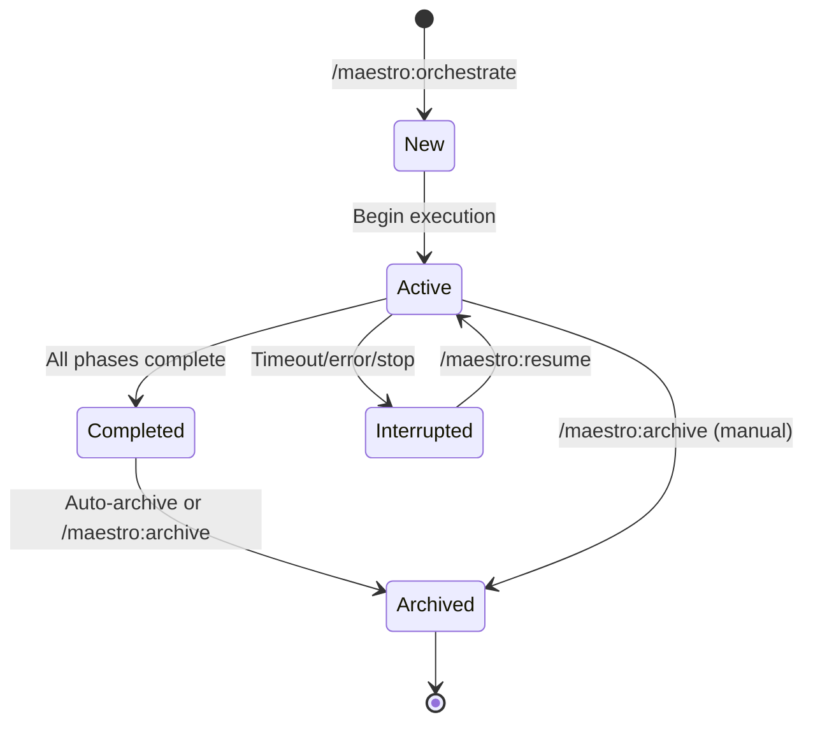
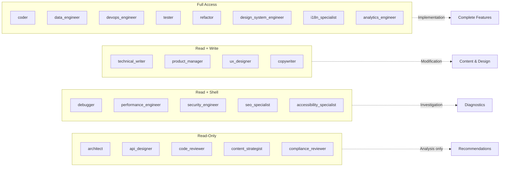

# Maestro Usage Guide

Comprehensive guide to installing, configuring, and using the Maestro multi-agent orchestration extension for Gemini CLI.

## Table of Contents

1. [Prerequisites](#prerequisites)
2. [Installation](#installation)
3. [Quick Start](#quick-start)
4. [Workflow Modes](#workflow-modes)
5. [Design Dialogue](#design-dialogue)
6. [Implementation Planning](#implementation-planning)
7. [Execution](#execution)
8. [Command Reference](#command-reference)
9. [Working with Sessions](#working-with-sessions)
10. [Agents](#agents)
11. [Configuration](#configuration)
12. [Tips and Best Practices](#tips-and-best-practices)
13. [Troubleshooting](#troubleshooting)

## Prerequisites

### Required Software

1. **Gemini CLI**: Maestro is a Gemini CLI extension. Install Gemini CLI from [https://github.com/google-gemini/gemini-cli](https://github.com/google-gemini/gemini-cli) before proceeding.

2. **Node.js**: Required for hooks and local helper scripts. Install Node.js 16 or later from [nodejs.org](https://nodejs.org).

### Enable Experimental Subagents

Maestro requires Gemini CLI's experimental subagent system. Enable it in your Gemini CLI settings file:

**Location**:
- macOS/Linux: `~/.gemini/settings.json`
- Windows: `%USERPROFILE%\.gemini\settings.json`

**Configuration**:
```json
{
  "experimental": {
    "enableAgents": true
  }
}
```

If the file does not exist, create it with the content above. If it exists, add the `experimental` section to your existing configuration.

**Important**: Native parallel subagents currently run in autonomous mode. Sequential delegation uses your current Gemini CLI approval mode. Review the [Gemini CLI subagents documentation](https://geminicli.com/docs/core/subagents/) for full details.

Maestro does not auto-edit `~/.gemini/settings.json`; enable `experimental.enableAgents` manually before orchestration.

## Installation

### From Git Repository

```bash
gemini extensions install https://github.com/josstei/maestro-gemini
```

This downloads the extension and registers it automatically.

### Local Development

```bash
git clone https://github.com/josstei/maestro-gemini
cd maestro-gemini
gemini extensions link .
```

The `link` command creates a symlink from your Gemini CLI extensions directory to the current directory. Run this from the cloned repository root.

### Verify Installation

Restart Gemini CLI after installation, then confirm the extension loaded:

```bash
gemini extensions list
```

You should see `maestro` in the list of active extensions.


## Quick Start

Path examples in this guide use the default `MAESTRO_STATE_DIR=docs/maestro` unless noted otherwise.

This walkthrough demonstrates a complete orchestration from start to finish.

Start a full orchestration by describing what you want to build:

```
/maestro:orchestrate Build a REST API for a task management system with user authentication
```

Maestro will walk you through the complete lifecycle:

1. **Design Dialogue** -- Maestro asks structured questions one at a time (problem scope, constraints, technology preferences, quality requirements, deployment context) and presents 2-3 architectural approaches with trade-offs.
2. **Design Review** -- The design document is presented section by section for your approval. Each section is 200-300 words covering requirements, architecture, component specs, team composition, risk assessment, and success criteria.
3. **Implementation Planning** -- Maestro generates a detailed plan with phase breakdown, agent assignments, dependency graph, parallel execution opportunities, and validation criteria. You review and approve before execution begins.
4. **Execution Mode Selection** -- Choose parallel dispatch (independent phases run concurrently as native subagents) or sequential delegation (one phase at a time with intervention opportunities).
5. **Phase-by-Phase Execution** -- Specialized agents implement the plan. Session state is updated after each phase with files changed, validation results, and token usage.
6. **Quality Gate** -- A final code review blocks completion on unresolved Critical or Major findings. The orchestrator remediates and re-validates until resolved.
7. **Completion & Archival** -- Maestro delivers a summary of files changed, token usage by agent, deviations from plan, and recommended next steps. The session is archived automatically.


### Express Mode Example

For simple tasks, Maestro detects low complexity and uses the Express workflow:

```
/maestro:orchestrate Add a health check endpoint to the Express server
```

Express mode follows a streamlined flow:

1. **Complexity classification**: Maestro determines the task is `simple` and selects Express workflow
2. **Clarifying questions** (1-2 turns): Maestro asks focused questions about problem scope only
3. **Structured brief**: Maestro presents a consolidated design+plan for approval:

```
## Express Brief: Health Check Endpoint

**Problem**: The Express server has no health check endpoint for load balancer and monitoring integration.

**Approach**: Add a GET /health endpoint returning JSON status with uptime and timestamp.
*Alternative*: Considered a HEAD-only endpoint but rejected for lack of response body.

**Files**:
| Action | Path | Purpose |
|--------|------|---------|
| Create | src/routes/health.js | Health check route handler |
| Modify | src/app.js | Register the health route |

**Agent**: coder -- Simple implementation task with clear requirements
**Validation**: npm test

Approve to proceed?
```

4. **Delegation**: Single-agent implementation
5. **Code review**: `code_reviewer` validates the changes
6. **Archival**: Session state archived automatically

## Workflow Modes

Maestro classifies every task by complexity before choosing a workflow mode. The classification happens automatically when you invoke `/maestro:orchestrate`, and the user can override the result.

### Complexity Classification

| Signal | Simple | Medium | Complex |
|--------|--------|--------|---------|
| Scope | Single concern, few files | Multi-component, clear boundaries | Cross-cutting, multi-service |
| Examples | Static sites, config changes, single-file scripts, CLI tools | API endpoints, feature additions, integrations, CRUD apps | New subsystems, refactors spanning modules, multi-service architectures |
| Greenfield | Empty or near-empty repo | Small existing codebase | Large codebase with established patterns |

### Express Workflow (Simple Tasks)

Express mode replaces the Standard 4-phase ceremony with a streamlined flow:

1. **Clarifying questions**: 1-2 `ask_user` turns covering problem scope and boundaries only. Questions already answered by the task description are combined or skipped.
2. **Structured brief**: A single approval prompt presenting the consolidated design+plan -- problem statement, approach with alternative, file manifest, agent assignment, and validation command.
3. **Session creation**: Creates session state with `workflow_mode: "express"`, `design_document: null`, `implementation_plan: null`, and a single phase.
4. **Delegation**: Single-agent implementation with full protocol injection (agent base protocol + filesystem safety protocol).
5. **Code review gate**: `code_reviewer` reviews all changes. Critical or Major findings trigger one retry with fix instructions. If the retry fails, the issue escalates to the user.
6. **Archival**: Session state archived. No design document or implementation plan to move.

Express always dispatches sequentially. It bypasses the execution mode gate entirely.

**Escalation to Standard**: If the user rejects the structured brief twice, Maestro escalates to Standard workflow -- overriding the classification to `medium` and starting from the beginning of the Standard flow.

### Standard Workflow (Medium/Complex Tasks)

The Standard workflow is a full 4-phase lifecycle:

1. **Phase 1: Design Dialogue** -- Structured requirements gathering with depth-selectable reasoning
2. **Phase 2: Team Assembly & Planning** -- 8-domain agent assignment, dependency mapping, plan generation
3. **Phase 3: Execution** -- Delegated implementation with parallel or sequential dispatch
4. **Phase 4: Completion** -- Quality gate, validation, archival, and summary

### Decision Table: When to Use Each Mode

Workflow mode is selected automatically by the complexity classifier, but understanding when each applies helps you write better task descriptions:

| Characteristic | Express | Standard |
|---|---|---|
| Task complexity | Simple | Medium or Complex |
| Agents involved | 1 | 2-22 |
| Design document | None | Full multi-section design |
| Implementation plan | None | Phase-by-phase with dependencies |
| Execution mode | Sequential only | Parallel or Sequential |
| User approval checkpoints | 1 (structured brief) | Multiple (design sections, plan, mode) |
| Typical duration | Minutes | 30 minutes to hours |

## Design Dialogue

The design dialogue is Phase 1 of the Standard workflow. It is not used in Express mode.

### Depth Selector

Before asking any design questions, Maestro presents a depth selector to control the level of reasoning applied throughout the design phase:

- **Quick** -- Standard reasoning behavior. One question per topic, pros/cons on approaches, standard design sections. No enrichment steps. Choose this when you already have clarity and want to move fast.
- **Standard** (Recommended) -- Adds assumption surfacing after each answer and a decision matrix during approach evaluation. Design sections gain rationale annotations tying decisions to project context.
- **Deep** -- Full treatment. Follow-up probing into implications, assumption surfacing with confirmation, trade-off narration on each choice, decision matrix with scoring, rationale annotations, per-decision alternatives, and full requirement traceability. Choose this for high-stakes or ambiguous tasks.

Depth and complexity are orthogonal. Complexity controls which sections appear and word count per section. Depth controls reasoning richness within each section. A user may select Deep depth on a Medium complexity task or Quick depth on a Complex task.

The chosen depth is recorded in the design document frontmatter as `design_depth: quick | standard | deep`.

### Codebase Investigation

For tasks targeting an existing codebase, Maestro calls the built-in `codebase_investigator` before proposing architectural approaches. The investigator gathers:

- Current architecture slice relevant to the task
- Most likely impacted modules and files
- Existing naming, layering, and testing conventions to preserve
- Integration points and dependency edges the design must respect
- Validation commands already used by the repo
- Parallelization or file-conflict risks that should shape the implementation plan

This grounds the design in reality rather than assumptions. For greenfield tasks, documentation-only work, or scopes already understood from direct file reads, the investigator is skipped.

### Domain Analysis

Before decomposing into phases, Maestro assesses the task across 8 capability domains proportional to task complexity:

| Domain | Signal Questions | Candidate Agents |
|--------|-----------------|-----------------|
| Engineering | Does the task involve code, infrastructure, or data? | architect, api_designer, coder, code_reviewer, tester, refactor, data_engineer, debugger, devops_engineer, performance_engineer, security_engineer, technical_writer |
| Product | Are requirements unclear, or does success depend on user outcomes? | product_manager |
| Design | Does the deliverable have a user-facing interface or interaction? | ux_designer, accessibility_specialist, design_system_engineer |
| Content | Does the task produce or modify user-visible text, copy, or media? | content_strategist, copywriter |
| SEO | Is the deliverable web-facing and discoverable by search engines? | seo_specialist |
| Compliance | Does the task handle user data, payments, or operate in a regulated domain? | compliance_reviewer |
| Internationalization | Must the deliverable support multiple locales? | i18n_specialist |
| Analytics | Does success need to be measured, or does the feature need instrumentation? | analytics_engineer |

Domain analysis scope by complexity:
- **Simple**: Engineering domain only. Other domains skipped unless explicitly requested.
- **Medium**: Engineering + domains with clear signals from the task description.
- **Complex**: Full 8-domain sweep.

### Architectural Approaches

After gathering requirements, Maestro presents 2-3 architectural approaches. Each includes:

- Summary and high-level architecture description
- Pros and cons
- Best-fit scenarios
- Risk level

Choose your preferred approach. Maestro accepts your choice without pushback and uses it to structure the design document.

### Section-by-Section Review

Once you choose an approach, Maestro presents the design document in sections (200-300 words each). The number of sections scales with complexity:

| Complexity | Minimum Sections |
|------------|-----------------|
| Simple | 3 |
| Medium | 4-5 |
| Complex | All 7 |

Standard sections include:
1. Problem Statement & Requirements
2. Selected Approach & Architecture
3. Component Specifications & Data Flow
4. Agent Team Composition & Phase Plan
5. Risk Assessment & Mitigation
6. Success Criteria
7. Non-Functional Requirements

After each section, you approve or request changes. Once all sections are approved, Maestro writes the design document to `<MAESTRO_STATE_DIR>/plans/YYYY-MM-DD-<topic>-design.md`.

## Implementation Planning

Implementation planning is Phase 2 of the Standard workflow. Express mode does not create an implementation plan.

### Grounded Decomposition

Maestro analyzes the approved design and breaks it into implementation phases. If the plan would otherwise rely on assumed file locations, unclear ownership boundaries, or guessed integration points, Maestro calls the `codebase_investigator` before decomposition to ground the plan in the actual repository structure.

Each phase is assigned:
- One or more specialized agents based on task domain
- A dependency graph showing which phases must complete before it can start
- A set of files the phase is expected to create or modify (file ownership)
- Validation criteria (specific commands to run after completion)

### Phase Count

Phase limits scale with task complexity:

| Complexity | Maximum Phases |
|------------|---------------|
| Simple | 3 |
| Medium | 5 |
| Complex | No cap |

### Dependency Optimization

Maestro maps dependencies between phases and identifies parallel execution opportunities. Phases at the same dependency depth with non-overlapping file ownership can be batched for parallel dispatch. The plan explicitly marks:

- `blocked_by`: list of phase IDs that must complete before this phase starts
- `parallel: true/false`: whether the phase is eligible for parallel execution
- File ownership boundaries per phase to prevent conflicts

### Plan Validation

Maestro validates the implementation plan for structural correctness:

- All phase dependencies reference valid phase IDs
- No circular dependency chains exist
- File ownership does not overlap across parallel-eligible phases
- Agent assignments match the available agent roster
- Validation commands are specified for phases that produce testable output

The validated plan is written to `<MAESTRO_STATE_DIR>/plans/YYYY-MM-DD-<topic>-impl-plan.md`. A session state file is created at `<MAESTRO_STATE_DIR>/state/active-session.md`.

## Execution

Execution is Phase 3 of the Standard workflow. Express mode uses single-agent delegation without an execution mode gate.

### Execution Mode Gate

The execution mode gate must resolve before any delegation proceeds. It is a hard gate -- delegation cannot begin until `execution_mode` is recorded in session state.

**Resolution flow:**

1. Read `MAESTRO_EXECUTION_MODE` (default: `ask`)
2. If `parallel`: record in session state, skip to delegation
3. If `sequential`: record in session state, skip to delegation
4. If `ask`: analyze the implementation plan and prompt the user

When prompting, Maestro presents plan analysis (total phases, parallelizable phases, distinct batches, sequential-only phases, file overlap warnings) and a recommendation:

- If parallelizable phases > 50% of total phases: recommend **parallel**
- If parallelizable phases <= 1: recommend **sequential**
- Otherwise: recommend **sequential** (limited parallelization benefit)

### Native Parallel Execution

When parallel mode is selected, Maestro dispatches independent phases as native subagent batches using Gemini CLI's built-in scheduler.

**How a batch executes:**

1. Identify the ready batch from the implementation plan (phases at the same dependency depth with non-overlapping file ownership)
2. Slice the ready batch using `MAESTRO_MAX_CONCURRENT` (`0` = dispatch full batch)
3. Mark the current chunk `in_progress` in session state and set `current_batch`
4. Emit contiguous subagent tool calls for the chunk -- agent calls only, no interleaved operations
5. Each delegation prompt includes:
   - Required headers: `Agent:`, `Phase:`, `Batch:`, `Session:`
   - Injected protocols: agent base protocol, filesystem safety protocol
   - Context chain from completed dependency phases
   - Downstream consumer declaration
6. Parse results from `## Task Report` and `## Downstream Context` sections
7. Persist results into session state
8. Advance to the next batch or clear `current_batch`

If a batch has only one phase, it executes sequentially even in parallel mode.

### Sequential Execution

When sequential mode is selected, Maestro delegates phases one at a time in dependency order. Each delegation includes the same protocol injection and context chain as parallel mode, but execution pauses between phases for state updates and validation.

Sequential mode preserves plan order even when phases are marked parallel-safe.

### MCP State Operations

Session state updates use MCP tools (`update_session`, `transition_phase`, `get_session_status`) for structured I/O and atomic transitions. If MCP tools are unavailable, Maestro falls back to direct filesystem operations on `<MAESTRO_STATE_DIR>/state/active-session.md`.

### Error Handling and Retries

If a phase fails:
1. The error is recorded in session state with retry count
2. Maestro retries automatically up to `MAESTRO_MAX_RETRIES` (default: 2) times
3. If retries are exhausted, the user is asked for guidance:
   - Retry with modified instructions
   - Skip the phase
   - Abort execution

### Code Review Gate

At the end of Phase 4 (Completion), if execution changed non-documentation files (source, test, config, scripts), Maestro runs a final `code_reviewer` quality gate on all changed files.

- **Critical or Major findings**: Block completion. The orchestrator remediates the findings, re-validates, and re-runs the review gate until resolved.
- **Minor or Suggestion findings**: Recorded and reported in the completion summary but do not block.

## Command Reference

### /maestro:orchestrate

Start a full Maestro orchestration for an engineering task.

**Syntax**:
```
/maestro:orchestrate <task description>
```

**Arguments**:
- `<task description>`: Natural language description of what you want to build or change

**Behavior**:
1. Checks for existing active sessions
2. Classifies task complexity (simple, medium, complex)
3. Routes to Express (simple) or Standard (medium/complex) workflow
4. Express: clarifying questions, brief, delegate, review, archive
5. Standard: design dialogue, planning, execution, completion

**When to Use**:
- Any engineering task, from simple config changes to complex multi-service architectures
- When you want Maestro to determine the appropriate workflow depth
- When you need structured orchestration with progress tracking

**Example**:
```
/maestro:orchestrate Build a REST API for a task management system with user authentication
```

**Expected Output**:
- Complexity classification with rationale
- Workflow-appropriate interactions (Express brief or Standard design dialogue)
- Phase-by-phase execution with progress updates
- Completion summary with files changed and next steps

### /maestro:execute

Execute an existing implementation plan, skipping design and planning phases.

**Syntax**:
```
/maestro:execute <path-to-implementation-plan>
```

**Arguments**:
- `<path-to-implementation-plan>`: Path to an implementation plan file (e.g., `docs/maestro/plans/2026-02-15-api-refactor-impl-plan.md`)
- If omitted, Maestro checks `<MAESTRO_STATE_DIR>/plans/` for the most recent plan

**Behavior**:
1. Reads the specified implementation plan
2. Creates a session state file for tracking
3. Presents an execution summary:
   - Total phases and agent assignments
   - Parallel execution opportunities
   - Estimated effort
4. Resolves execution mode via the mode gate
5. Executes phases according to the plan
6. Runs final code review gate on non-documentation changes
7. Archives the session on completion

**When to Use**:
- You have a pre-written implementation plan
- Skipping design dialogue to save time
- Re-executing a plan from a previous session

**Example**:
```
/maestro:execute docs/maestro/plans/2026-02-15-api-refactor-impl-plan.md
```

**Expected Output**:
```
Implementation Plan: 2026-02-15-api-refactor-impl-plan.md

Summary:
- 8 phases (4 parallelizable)
- Agents: coder (4 phases), refactor (2 phases), tester (2 phases)
- Estimated: 60-90 minutes

Execution Mode:
Which mode would you like to use? (parallel/sequential)
```

### /maestro:resume

Resume an interrupted orchestration session.

**Syntax**:
```
/maestro:resume
```

**Arguments**: None

**Behavior**:
1. Reads `<MAESTRO_STATE_DIR>/state/active-session.md`
2. Parses session metadata and phase statuses
3. Presents a status summary with completed/pending/failed phases
4. If errors exist, presents them and asks for guidance before retrying
5. For Express sessions (`workflow_mode: "express"`):
   - Phase `pending`: re-generates and presents the structured brief
   - Phase `in_progress`: re-delegates with the same scope
   - Phase `completed` but session `in_progress`: runs code review, then archives
6. For Standard sessions: continues from the last active/pending phase

**When to Use**:
- Orchestration was interrupted (timeout, manual stop, error)
- You want to check session state before continuing
- Previous execution failed and you have manually fixed the issue

**Example**:
```
/maestro:resume
```

**Expected Output**:
```
Resuming Session: 2026-02-15-task-management-api
Created: 2026-02-15T10:30:00Z

Phase Status:
  Phase 1: Database Schema Design (completed)
  Phase 2: Authentication Middleware (completed)
  Phase 3: REST API Endpoints (failed)
  Phase 4: Integration Tests (pending)

Unresolved Errors:
Phase 3 (coder):
  Type: validation
  Message: ESLint errors in src/routes/tasks.js - unused variable 'userId'

I'll retry Phase 3 now. Continue?
```

### /maestro:review

Run a standalone code review on staged changes, last commit, or specified paths.

**Syntax**:
```
/maestro:review [file paths or glob patterns]
```

**Arguments**:
- `[file paths or glob patterns]`: Optional. Specific files or patterns to review (e.g., `src/api/*.js`)
- If omitted, Maestro auto-detects scope: staged changes > last commit diff

**Behavior**:
1. Auto-detects review scope (priority order):
   - User-specified paths (if provided)
   - Staged changes (`git diff --staged`)
   - Last commit diff (`git diff HEAD~1`)
2. Confirms detected scope with you
3. Delegates to the `code_reviewer` agent
4. Presents findings classified by severity:
   - **Critical**: Security vulnerabilities, data loss risks
   - **Major**: Logic errors, performance issues, broken patterns
   - **Minor**: Code quality issues, style inconsistencies
   - **Suggestion**: Optimization opportunities, refactoring ideas
5. Every finding references a specific file and line number

**When to Use**:
- Before committing changes
- Reviewing a pull request
- Auditing specific files for quality issues
- Getting a second opinion on implementation

**Example**:
```
/maestro:review src/api/tasks.js src/api/users.js
```

**Expected Output**:
```
Code Review Report

Scope: src/api/tasks.js, src/api/users.js
Files Reviewed: 2
Lines Reviewed: 450

Findings:

CRITICAL (1):
- src/api/tasks.js:45 -- SQL injection vulnerability in raw query
  Use parameterized queries instead of string concatenation

MAJOR (2):
- src/api/users.js:78 -- Password stored in plain text
  Hash passwords with bcrypt before storing
- src/api/tasks.js:120 -- Missing error handling on database operations
  Wrap in try-catch and return appropriate HTTP status

MINOR (3):
- src/api/users.js:23 -- Inconsistent naming (snake_case vs camelCase)
- src/api/tasks.js:90 -- Magic number 100 should be a named constant
- src/api/users.js:150 -- Unused import 'lodash'

SUGGESTIONS (1):
- src/api/tasks.js:60-80 -- Consider extracting validation logic to middleware
```

### /maestro:debug

Focused debugging session to investigate and diagnose an issue.

**Syntax**:
```
/maestro:debug <issue description>
```

**Arguments**:
- `<issue description>`: Natural language description of the problem you are experiencing

**Behavior**:
1. Delegates to the `debugger` agent with your issue description
2. The debugger follows a systematic methodology:
   - **Reproduce**: Understand expected vs actual behavior
   - **Hypothesize**: Form 2-3 likely root causes
   - **Investigate**: Trace execution flow, examine logs, inspect state
   - **Isolate**: Narrow to specific code path and condition
   - **Verify**: Confirm root cause explains all symptoms
3. Presents findings including:
   - Root cause summary
   - Evidence (specific files, lines, log entries)
   - Execution trace from trigger to failure
   - Recommended fix with specific code location
   - Regression prevention suggestion

**When to Use**:
- Investigating a bug or unexpected behavior
- Understanding why a test is failing
- Tracing the source of an error message
- Getting help with a confusing stack trace

**Example**:
```
/maestro:debug User login returns 500 error when password contains special characters
```

**Expected Output**:
```
Debug Report: User Login 500 Error

Root Cause:
Password validation regex in src/auth/validate.js:34 does not escape special
characters, causing regex syntax errors when input contains characters like $ or ^.

Evidence:
- src/auth/validate.js:34 -- Regex pattern: /^[A-Za-z0-9!@#$%^&*()]+$/
- Error log: "Invalid regular expression: Unmatched ')'"
- Test case: Password "test^pass)" triggers the error

Execution Trace:
1. POST /api/login with password "test^pass)"
2. src/routes/auth.js:45 -> validatePassword(password)
3. src/auth/validate.js:34 -> new RegExp(pattern) throws SyntaxError
4. Error propagates to Express error handler
5. Returns 500 Internal Server Error

Recommended Fix:
File: src/auth/validate.js, Line: 34
Use a regex literal instead of new RegExp(), or escape special characters.

Regression Prevention:
Add test case for passwords with special characters in the validation test suite.
```

### /maestro:security-audit

Run a security assessment on the specified scope.

**Syntax**:
```
/maestro:security-audit <scope>
```

**Arguments**:
- `<scope>`: Files, directories, or components to audit (e.g., `src/auth`, `src/api/*.js`, `entire codebase`)

**Behavior**:
1. Delegates to the `security_engineer` agent with the specified scope
2. The security engineer performs:
   - OWASP Top 10 vulnerability review
   - Data flow analysis from input to output
   - Authentication and authorization assessment
   - Secrets management and credential handling audit
   - Dependency vulnerability scan
   - Threat modeling using STRIDE methodology
3. Presents findings with:
   - Severity (aligned with CVSS: Critical, High, Medium, Low)
   - Location (file and line)
   - Description and proof of concept
   - Remediation recommendation
   - Overall security posture assessment

**When to Use**:
- Before deploying to production
- After adding authentication or payment processing
- When handling sensitive user data
- Auditing third-party dependencies
- Compliance requirements (SOC 2, GDPR, HIPAA)

**Example**:
```
/maestro:security-audit src/auth src/api
```

**Expected Output**:
```
Security Audit Report

Scope: src/auth, src/api
Files Reviewed: 18
Lines Reviewed: 2,450

Findings:

CRITICAL (2):
- src/auth/jwt.js:23 -- Hardcoded JWT secret in source code
  Severity: Critical (CVSS 9.1)
  Threat: Secret exposure allows token forgery
  Remediation: Move secret to environment variable, rotate immediately

- src/api/users.js:67 -- SQL injection vulnerability
  Severity: Critical (CVSS 9.8)
  Threat: Attacker can read/modify database
  Remediation: Use parameterized queries

HIGH (3):
- src/auth/password.js:45 -- Weak password hashing (MD5)
- src/api/tasks.js:120 -- Missing authorization check
- src/auth/session.js:90 -- Session tokens not invalidated on logout

Overall Security Posture: High Risk
Critical issues must be addressed before production deployment.
```

### /maestro:perf-check

Run a performance analysis on the specified scope.

**Syntax**:
```
/maestro:perf-check <scope>
```

**Arguments**:
- `<scope>`: Files, directories, or components to analyze (e.g., `src/api/tasks.js`, `database queries`, `entire application`)

**Behavior**:
1. Delegates to the `performance_engineer` agent with the specified scope
2. The performance engineer follows a systematic methodology:
   - **Baseline**: Establish current performance metrics
   - **Profile**: Identify hotspots using appropriate tools
   - **Analyze**: Determine root cause of bottlenecks
   - **Recommend**: Propose optimizations ranked by impact-to-effort ratio
3. Presents findings with:
   - Performance baseline and key metrics
   - Bottleneck identification with evidence
   - Optimization recommendations ranked by impact
   - Expected improvement estimates
   - Measurement plan for validating improvements

**When to Use**:
- Application is slow or unresponsive
- Preparing for increased traffic
- Optimizing database queries
- Reducing resource usage (CPU, memory, bandwidth)
- Meeting performance SLAs

**Example**:
```
/maestro:perf-check src/api/tasks.js
```

**Expected Output**:
```
Performance Analysis Report

Scope: src/api/tasks.js
Analysis Type: Code Review + Query Profiling

Bottlenecks Identified:

1. N+1 Query Problem (HIGH IMPACT)
   Location: src/api/tasks.js:78-92
   Issue: Fetches task assignees in a loop (1 query per task)
   Evidence: 720ms spent on database I/O

2. Missing Index (MEDIUM IMPACT)
   Location: Database table 'tasks' on column 'assignee_id'
   Issue: Full table scan on every query

Optimization Recommendations (ranked by impact-to-effort):

1. Fix N+1 Query (HIGH IMPACT, LOW EFFORT)
   Change: Use JOIN or IN clause to fetch assignees in single query
   Expected Improvement: 700ms reduction
   Effort: 30 minutes

2. Add Database Index (HIGH IMPACT, LOW EFFORT)
   Change: CREATE INDEX idx_tasks_assignee ON tasks(assignee_id)
   Expected Improvement: 100ms reduction
   Effort: 5 minutes
```

### /maestro:seo-audit

Run a technical SEO assessment on web-facing deliverables.

**Syntax**:
```
/maestro:seo-audit <scope>
```

**Arguments**:
- `<scope>`: Files, directories, or URLs to audit (e.g., `src/pages`, `public/index.html`, `entire site`)

**Behavior**:
1. Delegates to the `seo_specialist` agent with the specified scope
2. Reviews meta tags, Open Graph data, structured data (JSON-LD), crawlability (robots.txt, sitemaps), canonical URLs, page speed factors, mobile responsiveness, and internal linking
3. Presents findings with priority ranking and actionable implementation guidance

**When to Use**:
- Before launching a web-facing product
- After redesigning page templates or URL structure
- When search traffic has dropped
- Validating structured data implementation

**Example**:
```
/maestro:seo-audit src/pages
```

### /maestro:a11y-audit

Run a WCAG accessibility audit on user-facing components.

**Syntax**:
```
/maestro:a11y-audit <scope>
```

**Arguments**:
- `<scope>`: Files, components, or pages to audit (e.g., `src/components`, `src/pages/login.tsx`)

**Behavior**:
1. Delegates to the `accessibility_specialist` agent with the specified scope
2. Reviews WCAG 2.1 conformance (A, AA, AAA), ARIA attribute usage, keyboard navigation paths, color contrast ratios, screen reader compatibility, focus management, and form labeling
3. Presents findings with conformance level, impact on user groups, and remediation steps

**When to Use**:
- Before launching user-facing features
- When building form-heavy interfaces
- To meet regulatory accessibility requirements
- After receiving accessibility complaints

**Example**:
```
/maestro:a11y-audit src/components
```

### /maestro:compliance-check

Run a regulatory compliance review on the specified scope.

**Syntax**:
```
/maestro:compliance-check <scope>
```

**Arguments**:
- `<scope>`: Files, modules, or areas to review (e.g., `src/data-handling`, `entire codebase`, `payment processing`)

**Behavior**:
1. Delegates to the `compliance_reviewer` agent with the specified scope
2. Reviews GDPR/CCPA data handling practices, license compatibility of dependencies, cookie consent implementation, privacy policy coverage, data retention policies, and cross-border data transfer considerations
3. Presents findings with specific regulatory references and remediation recommendations

**When to Use**:
- Before handling PII or payment data
- When adding third-party integrations that process user data
- Preparing for SOC 2, GDPR, or HIPAA compliance
- Reviewing open-source license compatibility

**Example**:
```
/maestro:compliance-check src/data-handling
```

### /maestro:status

Display the current orchestration session status.

**Syntax**:
```
/maestro:status
```

**Arguments**: None

**Behavior**:
1. Reads `<MAESTRO_STATE_DIR>/state/active-session.md`
2. Presents a concise status summary:
   - Session ID and creation timestamp
   - Workflow mode (express or standard)
   - Overall status (in_progress, completed, failed)
   - Phase breakdown with status indicators
   - File manifest (files created, modified, deleted)
   - Token usage (total and top agents)
   - Unresolved errors
3. Read-only -- does not modify state or continue execution

**When to Use**:
- Checking orchestration progress
- Understanding what has been completed
- Reviewing token usage before proceeding
- Identifying errors without resuming execution

**Example**:
```
/maestro:status
```

**Expected Output**:
```
Orchestration Session Status

Session ID: 2026-02-15-task-management-api
Created: 2026-02-15T10:30:00Z
Updated: 2026-02-15T11:45:00Z
Workflow: Standard
Status: In Progress

Phase Status:
  Phase 1: Database Schema Design (completed at 10:45)
  Phase 2: Authentication Middleware (completed at 11:20)
  Phase 3: REST API Endpoints (in progress since 11:25)
  Phase 4: Integration Tests (pending)
  Phase 5: Documentation (pending)

Files Changed:
- Created: 12 files
- Modified: 2 files
- Deleted: 0 files

Token Usage:
- Total: 45,000 tokens (28,000 input, 17,000 output)
- By Agent: coder (22k), data_engineer (15k), tester (8k)

Errors: None
```

### /maestro:archive

Archive the current active orchestration session.

**Syntax**:
```
/maestro:archive
```

**Arguments**: None

**Behavior**:
1. Checks for an active session at `<MAESTRO_STATE_DIR>/state/active-session.md`
2. If no active session exists, informs you there is nothing to archive
3. If an active session exists:
   - Presents a summary of what will be archived
   - Asks for confirmation (session may have incomplete phases)
   - For Standard sessions: moves design document, implementation plan, and session state to archive directories
   - For Express sessions: moves session state to archive (no design document or plan)
   - Updates session status to `completed`
4. Verifies archival was successful (no `active-session.md` remains)

**When to Use**:
- Manually archiving a completed session (when `MAESTRO_AUTO_ARCHIVE` is `false`)
- Cleaning up an incomplete session you no longer need
- Before starting a new orchestration (required if active session exists)

**Example**:
```
/maestro:archive
```

**Expected Output**:
```
Archive Confirmation

Active Session: 2026-02-15-task-management-api
Status: In Progress (3 of 5 phases completed)

This session will be archived with incomplete phases. Continue?

[After confirmation]

Archived Successfully:
- Design document -> docs/maestro/plans/archive/2026-02-15-task-management-api-design.md
- Implementation plan -> docs/maestro/plans/archive/2026-02-15-task-management-api-impl-plan.md
- Session state -> docs/maestro/state/archive/2026-02-15-task-management-api.md

No active session remains.
```

## Working with Sessions

### Session State Files

Maestro tracks all orchestration progress in `<MAESTRO_STATE_DIR>/state/active-session.md` using YAML frontmatter + Markdown body.



**Location**:
```
<your-project>/
└── docs/maestro/
    ├── plans/                          # Active design docs and implementation plans
    │   └── archive/                    # Completed plans
    ├── state/
    │   ├── active-session.md           # Current orchestration
    │   └── archive/                    # Completed sessions
    │       └── 2026-02-15-task-management-api.md
```

**State file structure**:
```yaml
---
session_id: "2026-02-15-task-management-api"
created: "2026-02-15T10:30:00Z"
updated: "2026-02-15T11:45:00Z"
status: "in_progress"
workflow_mode: "standard"
task_complexity: "medium"
execution_mode: "parallel"
execution_backend: "native"
design_document: "docs/maestro/plans/2026-02-15-task-management-api-design.md"
implementation_plan: "docs/maestro/plans/2026-02-15-task-management-api-impl-plan.md"
current_phase: 3
current_batch: null
total_phases: 5

token_usage:
  total_input: 45000
  total_output: 17000
  by_agent:
    coder: { input: 22000, output: 8000 }
    data_engineer: { input: 15000, output: 6000 }

phases:
  - id: 1
    name: "Database Schema Design"
    status: "completed"
    agents: ["data_engineer"]
    started: "2026-02-15T10:35:00Z"
    completed: "2026-02-15T10:45:00Z"
    files_created: ["src/db/schema.sql"]
    errors: []
    downstream_context: "..."
---

# Task Management API Orchestration Log

## Phase 1: Database Schema Design
...
```

### Express Session Lifecycle

Express sessions have a simplified lifecycle:

```yaml
---
workflow_mode: "express"
design_document: null
implementation_plan: null
total_phases: 1
phases:
  - id: 1
    name: "Health Check Endpoint"
    status: "completed"
    agents: ["coder"]
---
```

Express sessions go from creation to single-phase execution to code review to archival. No design document or implementation plan is created or archived.

### Resuming Interrupted Sessions

If orchestration is interrupted (timeout, manual stop, error), resume with:

```
/maestro:resume
```

Maestro will:
1. Read the session state
2. Present a summary of what is completed and what is pending
3. If errors exist, present them and ask for guidance
4. Continue from the last active/pending phase

**Common Resume Scenarios**:

1. **Timeout**: An agent took too long and was terminated
   - Review the timeout error in session state
   - Narrow the phase scope or tune the agent via Gemini CLI `agents.overrides` if needed
   - `/maestro:resume` to retry

2. **Validation Failure**: Build or tests failed after a phase
   - Review the error logs
   - Manually fix the issue
   - `/maestro:resume` to retry validation

3. **Manual Stop**: You stopped Gemini CLI mid-orchestration
   - `/maestro:resume` picks up where you left off

### Archiving Sessions

Sessions are automatically archived on completion if `MAESTRO_AUTO_ARCHIVE` is `true` (default).

To manually archive a session:

```
/maestro:archive
```

This moves:
- Design document to `<MAESTRO_STATE_DIR>/plans/archive/` (Standard only)
- Implementation plan to `<MAESTRO_STATE_DIR>/plans/archive/` (Standard only)
- Session state to `<MAESTRO_STATE_DIR>/state/archive/<session-id>.md`

### Multiple Sessions

Maestro enforces a single active session at a time. If you start `/maestro:orchestrate` with an existing active session, Maestro will:
1. Detect the active session
2. Present its status
3. Offer to resume or archive it
4. Wait for your decision before proceeding

This prevents conflicting orchestrations and accidental overwrites.

## Agents

### Agent Roster

Maestro coordinates 22 specialized subagents across 8 editorial domains:

All agents share a baseline tool set: `read_file`, `list_directory`, `glob`, `grep_search`, `read_many_files`, `ask_user`. Tool tiers reflect additional capabilities beyond that baseline.

| Agent | Domain | Specialization | Tool Tier |
|-------|--------|----------------|-----------|
| architect | Engineering | System design, technology selection, component design | Read-Only |
| api_designer | Engineering | REST/GraphQL endpoint design, API contracts | Read-Only |
| coder | Engineering | Feature implementation, clean code, SOLID principles | Full Access |
| code_reviewer | Engineering | Code quality review, bug detection, security checks | Read-Only |
| data_engineer | Engineering | Schema design, query optimization, ETL pipelines | Full Access |
| debugger | Engineering | Root cause analysis, execution tracing, log analysis | Read + Shell |
| devops_engineer | Engineering | CI/CD pipelines, containerization, infrastructure | Full Access |
| performance_engineer | Engineering | Profiling, bottleneck identification, optimization | Read + Shell |
| refactor | Engineering | Code modernization, technical debt, design patterns | Full Access |
| security_engineer | Engineering | Vulnerability assessment, OWASP, threat modeling | Read + Shell |
| tester | Engineering | Unit/integration/E2E tests, TDD, coverage analysis | Full Access |
| technical_writer | Engineering | API docs, READMEs, architecture documentation | Read + Write |
| product_manager | Product | Requirements gathering, PRDs, feature prioritization | Read + Write |
| ux_designer | Design | User flow design, interaction patterns, usability evaluation | Read + Write |
| design_system_engineer | Design | Design tokens, component APIs, theming architecture | Full Access |
| content_strategist | Content | Content planning, editorial calendars, audience targeting | Read-Only |
| copywriter | Content | Persuasive copy, landing pages, CTAs, brand voice | Read + Write |
| seo_specialist | SEO | Technical SEO audits, schema markup, crawlability | Read + Shell |
| accessibility_specialist | Compliance | WCAG compliance, ARIA review, keyboard navigation | Read + Shell |
| compliance_reviewer | Compliance | GDPR/CCPA auditing, license checks, data handling | Read-Only |
| i18n_specialist | Internationalization | String extraction, locale management, RTL support | Full Access |
| analytics_engineer | Analytics | Event tracking, conversion funnels, A/B test design | Full Access |


### Tool Access Tiers

Agents follow a least-privilege model with 4 access tiers:



- **Read-Only**: Analysis and recommendations only. Cannot modify files or run commands.
- **Read + Shell**: Can run commands to investigate but not modify files directly.
- **Read + Write**: Can create and modify files but not run shell commands.
- **Full Access**: Complete implementation capabilities including read, write, shell, and task tracking.

**Why this matters for delegation**:
- Delegating to `code_reviewer` gives you analysis, not fixes
- Delegating to `coder` gives you working code
- Delegating to `debugger` gives you root cause analysis with evidence, but not the fix itself
- Delegating to `security_engineer` gives you vulnerability assessment and remediation guidance

### Domain Coverage

Agents cover 8 editorial domains. Domain analysis during planning determines which domains are relevant:

| Domain | Agents | Coverage |
|--------|--------|----------|
| Engineering | architect, api_designer, coder, code_reviewer, data_engineer, debugger, devops_engineer, performance_engineer, refactor, security_engineer, tester, technical_writer | Architecture, implementation, testing, infrastructure, security |
| Product | product_manager | Requirements, PRDs, feature prioritization |
| Design | ux_designer, accessibility_specialist, design_system_engineer | User flows, WCAG compliance, design tokens |
| Content | content_strategist, copywriter | Content planning, persuasive copy, brand voice |
| SEO | seo_specialist | Technical SEO, schema markup, crawlability |
| Compliance | compliance_reviewer | GDPR/CCPA, licensing, data handling |
| Internationalization | i18n_specialist | String extraction, locale management, RTL |
| Analytics | analytics_engineer | Event tracking, conversion funnels, A/B testing |

## Configuration

Maestro works out of the box with sensible defaults. To customize behavior, set environment variables in your shell profile or project `.env` file.

### Environment Variables

| Variable | Default | Description |
|----------|---------|-------------|
| `MAESTRO_DISABLED_AGENTS` | _(none)_ | Comma-separated list of agent names to exclude from implementation planning |
| `MAESTRO_MAX_RETRIES` | `2` | Maximum retry attempts per phase before escalating to the user |
| `MAESTRO_AUTO_ARCHIVE` | `true` | Automatically archive session state on successful completion |
| `MAESTRO_VALIDATION_STRICTNESS` | `normal` | Post-phase validation strictness level (`strict`, `normal`, or `lenient`) |
| `MAESTRO_STATE_DIR` | `docs/maestro` | Base directory for session state and plans |
| `MAESTRO_MAX_CONCURRENT` | `0` | Maximum subagents emitted in one native parallel batch turn (`0` = dispatch the entire ready batch) |
| `MAESTRO_EXECUTION_MODE` | `ask` | Phase 3 execution mode: `parallel` (native concurrent subagents), `sequential` (one at a time), or `ask` (prompt each time) |


Setting resolution precedence: exported env var > workspace `.env` > extension `.env` > default.

You can set extension-scoped values interactively with:

```bash
gemini extensions config maestro
```

### Configuration Examples

**Exclude specific agents from planning**:
```bash
export MAESTRO_DISABLED_AGENTS=devops_engineer,performance_engineer
```

**Use parallel mode by default** (skip the mode gate prompt):
```bash
export MAESTRO_EXECUTION_MODE=parallel
```

**Disable auto-archive for manual review**:
```bash
export MAESTRO_AUTO_ARCHIVE=false
```

**Custom state directory**:
```bash
export MAESTRO_STATE_DIR=.maestro
```

**Limit parallel batch size** to 2 agents per batch:
```bash
export MAESTRO_MAX_CONCURRENT=2
```

**Increase retry attempts** for flaky environments:
```bash
export MAESTRO_MAX_RETRIES=3
```

### Validation Strictness

Controls how strictly Maestro enforces validation after each phase:

- **strict**: All failures and warnings block phase completion. Lint warnings, deprecation notices, and coverage decreases all block.
- **normal** (default): Build/lint/test errors block phase completion. Lint warnings, deprecation notices, and coverage decreases are recorded but do not block.
- **lenient**: All failures and warnings are recorded but do not block phase completion. The user reviews the accumulated report at completion.

Set via:
```bash
export MAESTRO_VALIDATION_STRICTNESS=strict
```

## Tips and Best Practices

### Effective Prompting for /maestro:orchestrate

**Be Specific**:
- Good: "Build a REST API for a task management system with user authentication, task CRUD, and assignment features"
- Bad: "Build an app"

**Mention Constraints**:
- "Build a REST API using Node.js and PostgreSQL for deployment on AWS Lambda"
- "Refactor the authentication system to use OAuth 2.0 while maintaining backward compatibility"

**Clarify Quality Requirements**:
- "Build a high-traffic API that can handle 10,000 requests per second"
- "Build a secure API for handling PII with GDPR compliance"

### Workflow Selection Tips

Maestro classifies complexity automatically, but you can influence the classification:

- **To encourage Express**: describe a focused, single-concern task: "Add a health check endpoint" rather than "Add monitoring infrastructure"
- **To encourage Standard**: describe multi-component scope or mention architectural concerns: "Build a REST API with authentication, database schema, and CI/CD pipeline"
- You can always override the classification when Maestro presents it

### Parallel vs Sequential Execution

**Choose Parallel When**:
- Independent phases with no file overlap
- Well-defined tasks with clear file ownership
- Time-sensitive projects where speed matters
- High trust in delegation prompts

**Choose Sequential When**:
- Phases may need interactive clarification
- Unfamiliar codebase or exploratory tasks
- Security-sensitive work requiring review between phases
- You want to review output after each phase

**Hybrid Approach**:
- Use `MAESTRO_EXECUTION_MODE=ask` (default) to choose mode per orchestration based on the specific plan analysis

### Token Usage Optimization

Token usage is tracked in session state and displayed in `/maestro:status` and completion summaries.

**Tips**:
- Tune agent models and limits with Gemini CLI `agents.overrides` when you need cost or latency control
- Break large tasks into smaller orchestrations to isolate token costs
- Review token usage with `/maestro:status` before proceeding to expensive phases
- Express workflow is inherently token-efficient due to its single-agent flow

**Cost Awareness**:
- Design dialogue is typically low-cost (single TechLead session)
- Planning is low-cost (single TechLead session)
- Execution is where token usage scales (one session per agent per phase)
- Native parallel execution often uses more total tokens but completes faster

### When to Use Specialized Commands vs Full Orchestration

```mermaid
flowchart TD
    Start([Need Help?]) --> Complex{Complex multi-agent task?}
    Complex -->|Yes| Orchestrate[/maestro:orchestrate]
    Complex -->|No| HasPlan{Have existing plan?}

    HasPlan -->|Yes| Execute[/maestro:execute]
    HasPlan -->|No| Interrupted{Interrupted session?}

    Interrupted -->|Yes| Resume[/maestro:resume]
    Interrupted -->|No| SpecializedTask{What kind of task?}

    SpecializedTask -->|Code review| Review[/maestro:review]
    SpecializedTask -->|Bug investigation| Debug[/maestro:debug]
    SpecializedTask -->|Performance issue| PerfCheck[/maestro:perf-check]
    SpecializedTask -->|Security concern| SecurityAudit[/maestro:security-audit]
    SpecializedTask -->|SEO issues| SeoAudit[/maestro:seo-audit]
    SpecializedTask -->|Accessibility| A11yAudit[/maestro:a11y-audit]
    SpecializedTask -->|Compliance| ComplianceCheck[/maestro:compliance-check]
    SpecializedTask -->|Check progress| Status[/maestro:status]
    SpecializedTask -->|Clean up| Archive[/maestro:archive]
```

**Use `/maestro:orchestrate` when**:
- Task requires multiple specialized agents
- You need architectural design before implementation
- Project is complex with dependencies between components
- You want a structured approach with clear checkpoints

**Use specialized commands when**:
- Single-purpose task (code review, debugging, security audit, performance analysis, SEO, accessibility, compliance)
- Quick feedback needed without full orchestration
- Reviewing existing code rather than building new features

## Troubleshooting

### Extension Not Loading

**Symptom**: Maestro commands (`/maestro:orchestrate`, etc.) are not available in Gemini CLI.

**Diagnosis**:
1. Verify the extension is linked:
   ```bash
   gemini extensions list
   ```
   You should see `maestro` in the list.

2. Check that `gemini-extension.json` exists in the extension directory.

**Solution**:
- If not linked: `gemini extensions link .` (from the cloned repository root)
- Restart Gemini CLI after linking
- Check Gemini CLI version (extensions require Gemini CLI 1.0+)

### Subagents Not Enabled

**Symptom**: Maestro reports "Subagents are not enabled" on startup.

**Diagnosis**:
Check `~/.gemini/settings.json` for:
```json
{
  "experimental": {
    "enableAgents": true
  }
}
```

**Solution**:
1. Open `~/.gemini/settings.json` in a text editor
2. Add the `experimental` section (or update existing file)
3. Save and restart Gemini CLI

Maestro will not update this setting automatically; update `~/.gemini/settings.json` manually, then restart Gemini CLI.

### Session State Corrupted

**Symptom**: `/maestro:resume` fails with YAML parsing errors.

**Diagnosis**:
Read the session state file and check for syntax errors in the YAML frontmatter (unmatched quotes, invalid indentation, etc.).

**Solution**:
1. **Manual Fix**: Edit `<MAESTRO_STATE_DIR>/state/active-session.md` to fix YAML syntax
2. **Archive and Restart**: `/maestro:archive` to move the corrupted session, then start fresh with `/maestro:orchestrate`
3. **Delete State**: Remove `active-session.md` and start fresh (loses progress)

### Parallel Execution Issues

**Symptom**: Parallel execution fails, stalls, or produces unexpected results.

**Diagnosis**:
1. Check session state to see whether the current batch actually started
2. Look for overlapping file ownership or dependency mistakes in the implementation plan
3. Check whether an agent asked a follow-up question that paused the batch

**Solution**:
1. Reduce batch size: `export MAESTRO_MAX_CONCURRENT=1`
2. Fall back to sequential mode: `export MAESTRO_EXECUTION_MODE=sequential`
3. Resume after tightening the plan: `/maestro:resume`

### Validation Failures

**Symptom**: Phase completes but validation (build/lint/tests) fails.

**Diagnosis**:
Check session state for validation error logs. Common causes:
- Lint errors (unused variables, style violations)
- Test failures (logic errors, missing mocks)
- Build errors (syntax errors, missing dependencies)

**Solution**:
1. Review error logs in session state
2. Manually fix the issue
3. `/maestro:resume` to retry validation
4. Adjust validation strictness if needed: `export MAESTRO_VALIDATION_STRICTNESS=lenient`

### File Conflicts

**Symptom**: Agent reports file conflict during parallel execution.

**Diagnosis**:
Multiple agents tried to modify the same file (parallel execution with file overlap).

**Solution**:
1. Maestro will stop and report conflict details
2. Review which agents conflicted
3. Manually resolve conflicts
4. Resume with sequential mode:
   ```bash
   export MAESTRO_EXECUTION_MODE=sequential
   /maestro:resume
   ```

### Cannot Find Active Session

**Symptom**: `/maestro:resume` or `/maestro:status` reports "No active session found".

**Diagnosis**:
Check if `active-session.md` exists under your configured state directory (default: `docs/maestro/state/`).

**Solution**:
- If file does not exist: Start a new orchestration with `/maestro:orchestrate`
- If file is in archive: Start fresh or review the archived file
- Check `MAESTRO_STATE_DIR` if you have customized it: `echo $MAESTRO_STATE_DIR`

### Getting Help

If you encounter issues not covered here:

1. Review session state logs in `<MAESTRO_STATE_DIR>/state/active-session.md`
2. Check Maestro version: `gemini extensions list`
3. Review Gemini CLI logs (location varies by installation)
4. Report issues on GitHub: [https://github.com/josstei/maestro-gemini/issues](https://github.com/josstei/maestro-gemini/issues)

Include: Maestro version, Gemini CLI version, session state file (redact sensitive data), error messages, and steps to reproduce.
