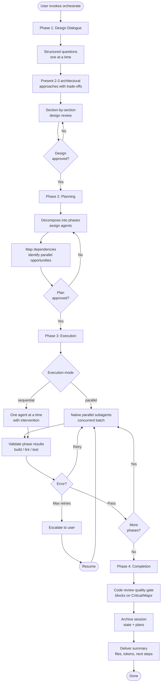

# Maestro

[](https://github.com/josstei/maestro-claude/releases)
[](LICENSE)
[](https://docs.anthropic.com/en/docs/claude-code)

Multi-agent development orchestration platform — 22 specialists, 4-phase orchestration, native parallel subagents, persistent sessions, and standalone review/debug/security/perf/seo/a11y/compliance commands

## Installation

### From Git Repository

```bash
claude plugin install https://github.com/josstei/maestro-claude
```

This downloads the plugin and registers it automatically.

### Local Development

```bash
git clone https://github.com/josstei/maestro-claude
cd maestro-gemini
claude plugin link .
```

The `link` command creates a symlink from your Claude Code plugins directory to the current directory. Run this from the cloned repository root.

### Verify Installation

Restart Claude Code after installation, then confirm the plugin loaded:

```bash
gemini extensions list
```

You should see `maestro` in the list of active plugins.


## Quick Start

Start a full orchestration by describing what you want to build:

```
/maestro:orchestrate Build a REST API for a task management system with user authentication
```

Maestro will walk you through the complete lifecycle:

1. **Design Dialogue** -- Maestro asks structured questions one at a time (problem scope, constraints, technology preferences, quality requirements, deployment context) and presents 2-3 architectural approaches with trade-offs.
2. **Design Review** -- The design document is presented section by section for your approval. Each section is 200-300 words covering requirements, architecture, component specs, team composition, risk assessment, and success criteria.
3. **Implementation Planning** -- Maestro generates a detailed plan with phase breakdown, agent assignments, dependency graph, parallel execution opportunities, and validation criteria. You review and approve before execution begins.
4. **Execution Mode Selection** -- Choose parallel dispatch (independent phases run concurrently as native subagents) or sequential delegation (one phase at a time with intervention opportunities).
5. **Phase-by-Phase Execution** -- Specialized agents implement the plan. Session state is updated after each phase with files changed, validation results, and token usage.
6. **Quality Gate** -- A final code review blocks completion on unresolved Critical or Major findings. The orchestrator remediates and re-validates until resolved.
7. **Completion & Archival** -- Maestro delivers a summary of files changed, token usage by agent, deviations from plan, and recommended next steps. The session is archived automatically.


## Commands

| Command | Purpose |
|---------|---------|
| `/maestro:orchestrate` | Full orchestration workflow (design, plan, execute, complete) |
| `/maestro:execute` | Execute an approved implementation plan, skipping design and planning |
| `/maestro:status` | Display current session status without modifying state |
| `/maestro:resume` | Resume an interrupted orchestration session |
| `/maestro:archive` | Archive the active session and move artifacts to archive directories |
| `/maestro:review` | Standalone code review with severity-classified findings |
| `/maestro:debug` | Standalone debugging session with systematic root cause analysis |
| `/maestro:security-audit` | Standalone security assessment (OWASP, threat modeling, data flow) |
| `/maestro:perf-check` | Standalone performance analysis with optimization recommendations |
| `/maestro:seo-audit` | Standalone SEO assessment (meta tags, structured data, crawlability) |
| `/maestro:a11y-audit` | Standalone accessibility audit (WCAG compliance, ARIA, keyboard navigation) |
| `/maestro:compliance-check` | Standalone regulatory compliance review (GDPR/CCPA, licensing, data handling) |


## Agents

All agents share a baseline tool set: `Read`, `Bash (ls) / Glob`, `Glob`, `Grep`, `multiple Read calls`, `AskUserQuestion`. Tool tiers reflect additional capabilities beyond that baseline.

| Agent | Domain | Specialization | Tool Tier |
|-------|--------|----------------|-----------|
| architect | Engineering | System design, technology selection, component design | Read-Only |
| api_designer | Engineering | REST/GraphQL endpoint design, API contracts | Read-Only |
| coder | Engineering | Feature implementation, clean code, SOLID principles | Full Access |
| code_reviewer | Engineering | Code quality review, bug detection, security checks | Read-Only |
| data_engineer | Engineering | Schema design, query optimization, ETL pipelines | Full Access |
| debugger | Engineering | Root cause analysis, execution tracing, log analysis | Read + Shell |
| devops_engineer | Engineering | CI/CD pipelines, containerization, infrastructure | Full Access |
| performance_engineer | Engineering | Profiling, bottleneck identification, optimization | Read + Shell |
| refactor | Engineering | Code modernization, technical debt, design patterns | Full Access |
| security_engineer | Engineering | Vulnerability assessment, OWASP, threat modeling | Read + Shell |
| tester | Engineering | Unit/integration/E2E tests, TDD, coverage analysis | Full Access |
| technical_writer | Engineering | API docs, READMEs, architecture documentation | Read + Write |
| product_manager | Product | Requirements gathering, PRDs, feature prioritization | Read + Write |
| ux_designer | Design | User flow design, interaction patterns, usability evaluation | Read + Write |
| design_system_engineer | Design | Design tokens, component APIs, theming architecture | Full Access |
| content_strategist | Content | Content planning, editorial calendars, audience targeting | Read-Only |
| copywriter | Content | Persuasive copy, landing pages, CTAs, brand voice | Read + Write |
| seo_specialist | SEO | Technical SEO audits, schema markup, crawlability | Read + Shell |
| accessibility_specialist | Compliance | WCAG compliance, ARIA review, keyboard navigation | Read + Shell |
| compliance_reviewer | Compliance | GDPR/CCPA auditing, license checks, data handling | Read-Only |
| i18n_specialist | Internationalization | String extraction, locale management, RTL support | Full Access |
| analytics_engineer | Analytics | Event tracking, conversion funnels, A/B test design | Full Access |


## Configuration

| Variable | Default | Description |
|----------|---------|-------------|
| `MAESTRO_DISABLED_AGENTS` | _(none)_ | Comma-separated list of agent names to exclude from implementation planning |
| `MAESTRO_MAX_RETRIES` | `2` | Maximum retry attempts per phase before escalating to the user |
| `MAESTRO_AUTO_ARCHIVE` | `true` | Automatically archive session state on successful completion |
| `MAESTRO_VALIDATION_STRICTNESS` | `normal` | Post-phase validation strictness level (`strict`, `normal`, or `lenient`) |
| `MAESTRO_STATE_DIR` | `docs/maestro` | Base directory for session state and plans |
| `MAESTRO_MAX_CONCURRENT` | `0` | Maximum subagents emitted in one native parallel batch turn (`0` = dispatch the entire ready batch) |
| `MAESTRO_EXECUTION_MODE` | `ask` | Phase 3 execution mode: `parallel` (native concurrent subagents), `sequential` (one at a time), or `ask` (prompt each time) |


## Workflow




## Documentation

- [USAGE.md](./USAGE.md) -- detailed usage guide with examples
- [OVERVIEW.md](./OVERVIEW.md) -- how Maestro works under the hood

## Generated

This plugin is generated by [overture](https://github.com/josstei/overture), a multi-runtime generator framework. Do not edit files directly -- changes should be made in the overture source and regenerated.

## License

Apache-2.0
