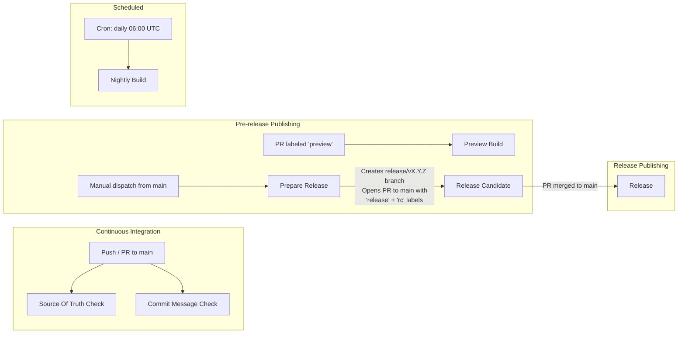
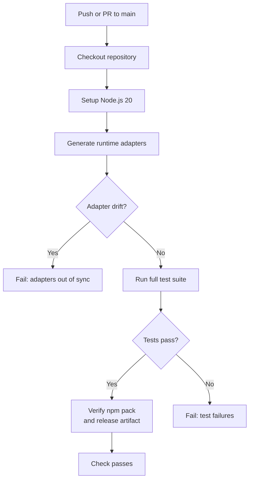
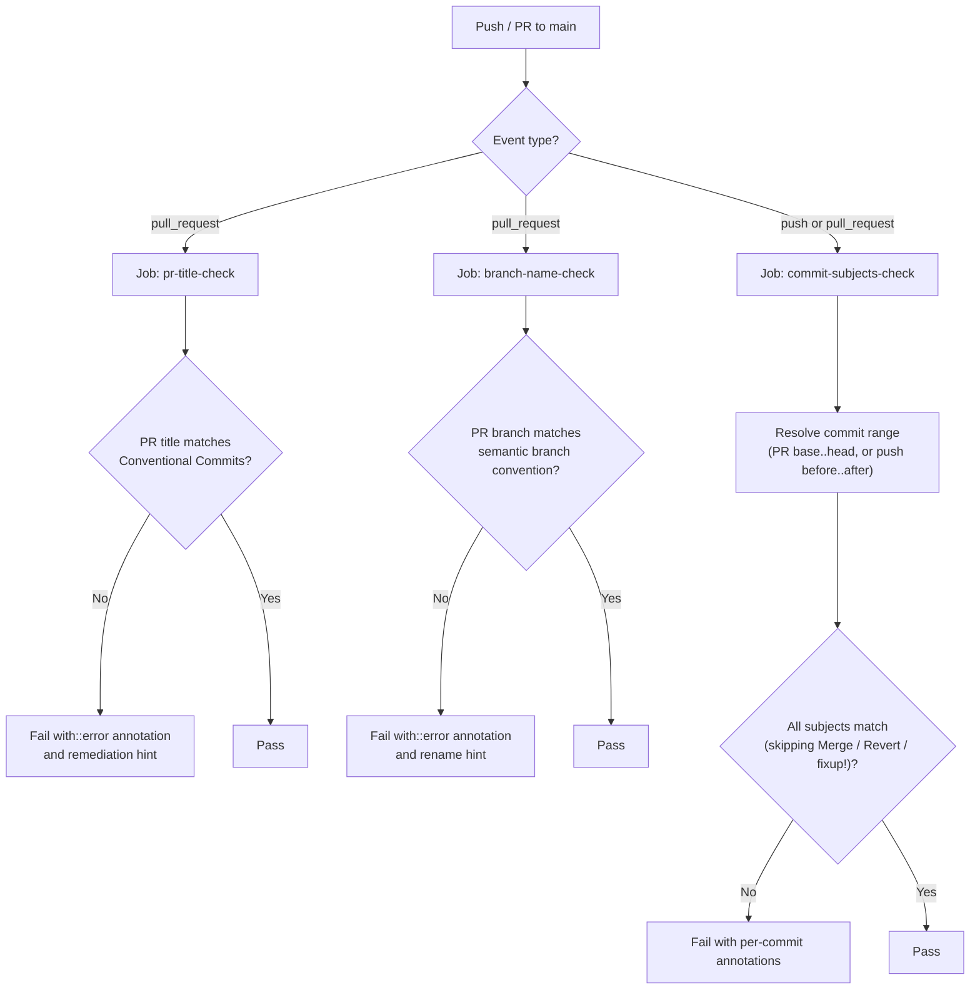
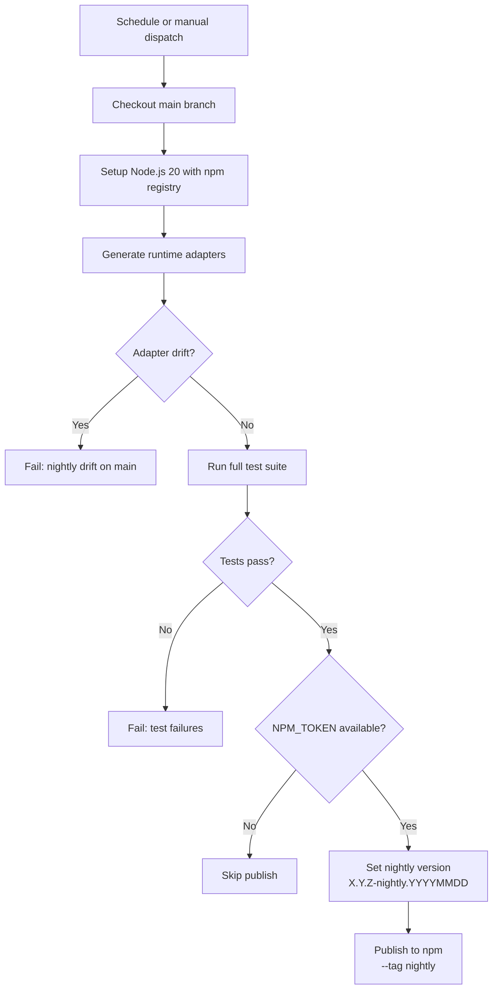
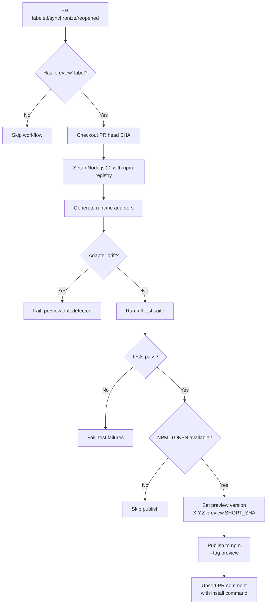
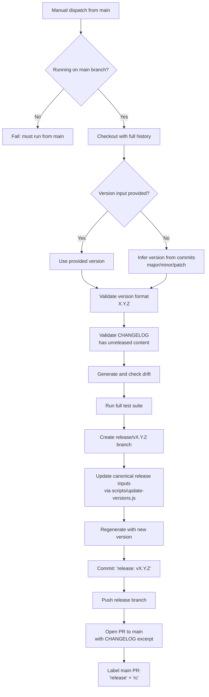
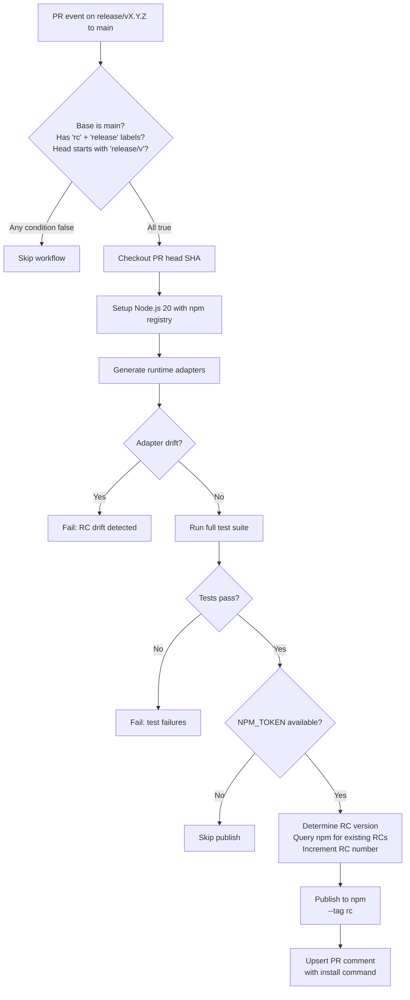
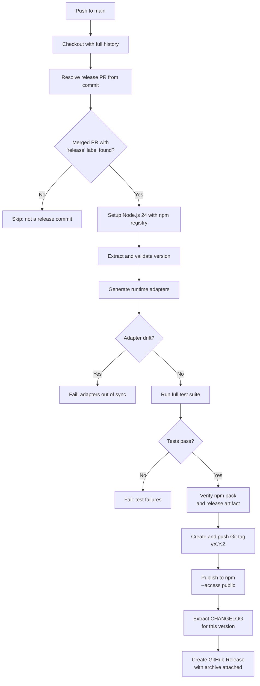
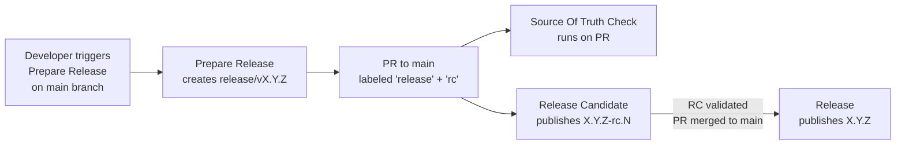
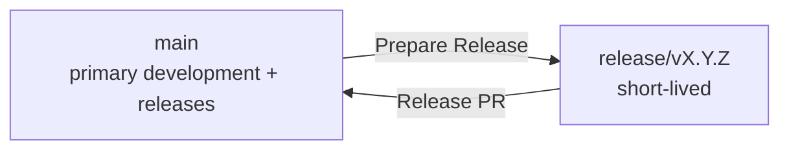

<!-- Source: .github/workflows/*.yml, justfile -->

# CI/CD Pipeline

Maestro uses seven GitHub Actions workflows. Six are organized around a **source-of-truth enforcement** model — each regenerates runtime adapters from canonical `src/` and verifies zero drift before proceeding. The seventh, **Commit Message Check**, validates semantic git conventions for PR branch names, PR titles, and commit subjects targeting `main`. Together they span continuous integration on every push/PR through automated release publishing to npm.

## Workflow Overview



The six source-of-truth workflows share a common validation core: generate runtime adapters, check for drift, and run the full test suite. Source Of Truth Check and stable Release also verify npm package contents and the self-contained release archive. Nightly Build, Preview Build, and Release Candidate keep best-effort npm publishing gated on `NPM_TOKEN`; stable Release publishes through npm Trusted Publishing with GitHub Actions OIDC. Commit Message Check is independent: it does not regenerate or test, it only validates branch naming, PR-title formatting, and commit-subject formatting.

## Source Of Truth Check

### Purpose

The foundational CI gate. Enforces that all generated runtime adapters (Gemini, Claude Code, Codex) are in sync with canonical source in `src/`, and that the full test suite passes. Runs on every push and pull request targeting `main`.

### Trigger

| Event | Branches |
|-------|----------|
| `push` | `main` |
| `pull_request` | `main` |

### Flow



### Job Breakdown

**Job: `check-architecture` (name: `source-of-truth-check`)**

| Step | Description |
|------|-------------|
| Checkout | Pins `actions/checkout` to SHA `11bd71901bbe5b1630ceea73d27597364c9af683` (v4.2.2) |
| Setup Node.js | Installs Node.js 20 via `actions/setup-node@v4` |
| Generate runtime adapters | Runs `node scripts/generate.js` to rebuild all runtime outputs |
| Check adapter drift | Runs `git diff --exit-code --name-only`; fails with annotation if any generated file differs from what is committed |
| Run full test suite | Executes `node --test tests/unit/*.test.js tests/transforms/*.test.js tests/integration/*.test.js` |
| Verify npm package contents | Runs `npm run pack:verify` to ensure npm dry-run packaging contains required runtime files and no test-only directories |
| Package and verify release artifact | Runs `npm run release:artifacts` and `npm run release:verify-artifacts` to validate the generic GitHub Release archive |

### Environment and Secrets

Uses default permissions (read-only). No secrets or environment variables required.

### Artifacts

Creates an ignored local `dist/release/maestro-vX.Y.Z-extension.tar.gz` during validation, but does not upload it from PR CI.

### Key Behaviors

- The drift check emits a GitHub Actions error annotation (`::error::`) with a `git diff --stat` summary on failure, providing immediate visibility into which files drifted.
- This workflow serves as the required status check that blocks PR merges.

---

## Commit Message Check

### Purpose

Enforces semantic git conventions for work targeting `main`: PR branch names must use the repo's semantic branch format, PR titles must follow [Conventional Commits](https://www.conventionalcommits.org/en/v1.0.0/), and every commit subject in the PR range must be conventional. This closes the local-hook bypass (`git commit --no-verify`) by re-validating in CI. The workflow also runs on direct pushes to `main` to cover admin overrides and emergency hotfixes that bypass the PR flow.

### Trigger

| Event | Branches | Types |
|-------|----------|-------|
| `pull_request` | `main` | `opened`, `edited`, `reopened`, `synchronize` |
| `push` | `main` | — |

### Flow



### Job Breakdown

**Job: `check-pr-title` (name: `pr-title-check`)** — runs only on `pull_request` events.

| Step | Description |
|------|-------------|
| Validate PR title | Reads `github.event.pull_request.title` via the `PR_TITLE` env var; tests it against the Conventional Commits regex; emits `::error::` annotation with format guidance on failure |

No checkout step — the job reads only event-payload metadata.

**Job: `check-pr-branch` (name: `branch-name-check`)** — runs only on `pull_request` events.

| Step | Description |
|------|-------------|
| Validate PR branch | Reads `github.event.pull_request.head.ref`; accepts `<type>/<slug>`, `<namespace>/<type>/<slug>`, `release/vX.Y.Z`, protected branch names, and known automation prefixes; emits `::error::` annotation with rename guidance on failure |

No checkout step — the job reads only event-payload metadata.

**Job: `check-commits` (name: `commit-subjects-check`)** — runs on both event types.

| Step | Description |
|------|-------------|
| Checkout | Pins `actions/checkout` to SHA `11bd71901bbe5b1630ceea73d27597364c9af683` (v4.2.2) with `fetch-depth: 0` to access the full history |
| Validate commit subjects | Resolves the commit range from the event (PR: `base.sha..head.sha`; push: `before..after`, or `after~1..after` on initial push); iterates `git log --format='%H %s'`; tests each subject against the regex with pass-throughs for `Merge`, `Revert`, `fixup!`, `squash!`, `amend!` |

### Environment and Secrets

`permissions: contents: read` (least privilege; only needs to read the repository). No secrets required. Safe for fork PRs.

### Artifacts

None produced or consumed.

### Key Behaviors

- The PR-title regex matches the local hook regex character-for-character, ensuring local-pass and CI-pass agree.
- The PR-branch regex mirrors `.githooks/pre-commit` and `.githooks/pre-push`, so branch names are checked locally before committing, locally before pushing, and in CI before merging.
- Pass-throughs (`Merge `, `Revert `, `fixup!`, `squash!`, `amend!`) match those in `.githooks/commit-msg`, so git-generated subjects (interactive rebases, merges, reverts) are accepted in both layers.
- Bot-authored release commits (`release: vX.Y.Z` from Prepare Release) match the regex without exception.
- The `push` trigger means even a direct admin push to `main` is validated post-hoc — failures appear as red checks on the commit on `main`.

---

## Nightly Build

### Purpose

Publishes a nightly snapshot of the `main` branch to npm under the `nightly` dist-tag. Validates the `main` branch has no drift and passes all tests before publishing. Runs on a daily schedule and can be triggered manually.

### Trigger

| Event | Details |
|-------|---------|
| `schedule` | Cron: `0 6 * * *` (daily at 06:00 UTC) |
| `workflow_dispatch` | Manual trigger with no inputs |

### Flow



### Job Breakdown

**Job: `nightly`**

| Step | Description |
|------|-------------|
| Checkout | Checks out `refs/heads/main` explicitly, pinned to SHA `11bd71901bbe5b1630ceea73d27597364c9af683` |
| Setup Node.js | Node.js 20 with `registry-url` set to `https://registry.npmjs.org` |
| Generate runtime adapters | Runs `node scripts/generate.js` |
| Check adapter drift | Fails with `::error::Nightly drift detected on main` if generated files differ |
| Run full test suite | Executes the full test suite |
| Determine publish eligibility | Sets `enabled=true` output if `NPM_TOKEN` secret is present |
| Set nightly version | Computes version as `{base}-nightly.{YYYYMMDD}` using `npm version --no-git-tag-version` |
| Regenerate runtime metadata | Runs `node scripts/generate.js` so runtime manifests and MCP package specs use the nightly version |
| Verify npm package contents | Runs `npm run pack:verify` against the nightly package surface |
| Publish nightly | Publishes through `node scripts/npm-publish-idempotent.js --tag nightly --access public`, skipping if the exact version already exists |

### Environment and Secrets

| Item | Type | Purpose |
|------|------|---------|
| `NPM_TOKEN` | Secret | Authenticates with npm registry for publishing |
| `NODE_AUTH_TOKEN` | Env (derived) | Set to `$NPM_TOKEN` value for npm CLI authentication |

**Permissions**: `contents: read`

### Artifacts

Publishes `@josstei/maestro@X.Y.Z-nightly.YYYYMMDD` to npm with the `nightly` dist-tag.

### Key Behaviors

- Always checks out the `main` branch regardless of what triggered it.
- The version string includes the date stamp, so each nightly replaces the previous day's version on the `nightly` tag.
- When `NPM_TOKEN` is absent, the workflow still validates drift and runs tests, providing health checks for forks.

---

## Preview Build

### Purpose

Publishes a preview package from a pull request so reviewers can install and test changes before merging. Activated by adding the `preview` label to any PR.

### Trigger

| Event | Details |
|-------|---------|
| `pull_request` | Types: `labeled`, `synchronize`, `reopened` |
| **Condition** | PR must have the `preview` label |

### Flow



### Job Breakdown

**Job: `preview`**

| Step | Description |
|------|-------------|
| Checkout | Checks out the PR head repository and SHA (supports fork PRs) |
| Setup Node.js | Node.js 20 with npm registry URL |
| Generate runtime adapters | Runs `node scripts/generate.js` |
| Check adapter drift | Fails with `::error::Preview drift detected` if drift exists |
| Run full test suite | Executes the full test suite |
| Determine publish eligibility | Gates on `NPM_TOKEN` presence |
| Set preview version | Computes version as `{base}-preview.{7-char SHA}` |
| Regenerate runtime metadata | Runs `node scripts/generate.js` so runtime manifests and MCP package specs use the preview version |
| Verify npm package contents | Runs `npm run pack:verify` against the preview package surface |
| Publish preview | Publishes through `node scripts/npm-publish-idempotent.js --tag preview --access public`, skipping if the exact version already exists |
| Upsert PR comment | Posts or updates a PR comment with the install command |

### Environment and Secrets

| Item | Type | Purpose |
|------|------|---------|
| `NPM_TOKEN` | Secret | npm registry authentication |
| `NODE_AUTH_TOKEN` | Env (derived) | Set to `$NPM_TOKEN` for npm CLI |
| `GH_TOKEN` | Env (derived) | Set to `${{ github.token }}` for PR comment API calls |

**Permissions**: `contents: read`, `pull-requests: write`

### Artifacts

Publishes `@josstei/maestro@X.Y.Z-preview.SHORT_SHA` to npm with the `preview` dist-tag.

### Key Behaviors

- Uses concurrency group `preview-{PR number}` with `cancel-in-progress: true`, so pushing new commits cancels any in-flight preview build for the same PR.
- The PR comment is **upserted**: if a comment starting with "Preview published:" already exists, it is updated in place rather than posting a duplicate.
- The version embeds the first 7 characters of the commit SHA, making each preview uniquely traceable to a specific commit.

---

## Prepare Release

### Purpose

Orchestrates the release preparation process. Creates a release branch from `main`, bumps version numbers, and opens a pull request targeting `main` (the actual release PR). This is the entry point for the release pipeline.

### Trigger

| Event | Details |
|-------|---------|
| `workflow_dispatch` | Manual trigger from the `main` branch only |
| **Input** | `version` (optional string): explicit version to release; when omitted, the version is inferred from commit history |

### Flow



### Job Breakdown

**Job: `prepare`**

| Step | Description |
|------|-------------|
| Validate branch | Fails if not running from `refs/heads/main` |
| Checkout | Full history (`fetch-depth: 0`) using `RELEASE_TOKEN` for push permissions |
| Setup Node.js | Installs Node.js 20 via `actions/setup-node@v4` |
| Infer version from commits | Scans commit logs since last tag; determines bump level: `BREAKING CHANGE` or `!:` triggers major, `feat` triggers minor, otherwise patch |
| Resolve target version | Uses explicit input if provided, otherwise uses inferred version |
| Validate target version | Ensures version matches `X.Y.Z` semver pattern |
| Validate CHANGELOG | Fails if the `[Unreleased]` section in `CHANGELOG.md` has no content |
| Generate and check drift | Runs generator and fails if `main` has uncommitted drift |
| Run full test suite | Executes the full test suite |
| Create release branch | Creates `release/vX.Y.Z` from current `main` |
| Update canonical release inputs | Runs `node scripts/update-versions.js` with the target version to update `package.json`, README badges, and CHANGELOG |
| Regenerate with new version | Reruns generator to derive runtime metadata from `package.json`, then runs `npm install --package-lock-only` to update lockfile |
| Commit release | Commits all changes as `release: vX.Y.Z` using the `github-actions[bot]` identity |
| Push release branch | Pushes `release/vX.Y.Z` to origin |
| Open PR to main | Creates a PR merging `release/vX.Y.Z` into `main` with CHANGELOG excerpt as body |
| Label release PR | Adds `release` and `rc` labels to the main-targeting PR |

### Environment and Secrets

| Item | Type | Purpose |
|------|------|---------|
| `RELEASE_TOKEN` | Secret | Personal access token with write permissions; used for checkout, branch push, PR creation, and auto-merge. Required because the default `GITHUB_TOKEN` cannot trigger downstream workflows. |

**Permissions**: `contents: write`, `pull-requests: write`

### Artifacts

Creates the `release/vX.Y.Z` branch and a pull request targeting `main` with the CHANGELOG excerpt.

### Key Behaviors

- The version inference algorithm uses conventional commit patterns: `BREAKING CHANGE` or `!:` in commit messages triggers a major bump, `feat` commits trigger minor, everything else triggers patch.
- The CHANGELOG validation ensures no release ships without documented changes.
- The `release` and `rc` labels on the main-targeting PR are what trigger the Release Candidate workflow.
- Uses `RELEASE_TOKEN` (not the default `GITHUB_TOKEN`) so that the push and PR creation events trigger downstream workflow runs (Source Of Truth Check on the new PR, and Release Candidate when labels are applied).

---

## Release Candidate

### Purpose

Publishes release candidate packages to npm from release PRs targeting `main`. Activates automatically when the Prepare Release workflow labels a PR with both `release` and `rc`. Provides an installable RC package for final validation before the release merges.

### Trigger

| Event | Details |
|-------|---------|
| `pull_request` | Types: `labeled`, `synchronize`, `reopened` |
| **Conditions (all must be true)** | Base branch is `main` |
| | PR has both `rc` and `release` labels |
| | Head branch starts with `release/v` |

### Flow



### Job Breakdown

**Job: `rc`**

| Step | Description |
|------|-------------|
| Checkout | Checks out the PR head repository and SHA |
| Setup Node.js | Node.js 20 with npm registry URL |
| Generate runtime adapters | Runs `node scripts/generate.js` |
| Check adapter drift | Fails with `::error::RC drift detected` |
| Run full test suite | Executes the full test suite |
| Determine publish eligibility | Gates on `NPM_TOKEN` presence |
| Determine RC version | Reads base version from `package.json`, queries npm registry for existing RC versions of this base, increments the RC number to avoid collisions |
| Regenerate runtime metadata | Runs `node scripts/generate.js` so runtime manifests and MCP package specs use the RC version |
| Verify npm package contents | Runs `npm run pack:verify` against the RC package surface |
| Publish RC | Publishes through `node scripts/npm-publish-idempotent.js --tag rc --access public`, skipping if the exact version already exists |
| Upsert PR comment | Posts or updates a comment with install command and short SHA |

### Environment and Secrets

| Item | Type | Purpose |
|------|------|---------|
| `NPM_TOKEN` | Secret | npm registry authentication |
| `NODE_AUTH_TOKEN` | Env (derived) | Set to `$NPM_TOKEN` for npm CLI |
| `GH_TOKEN` | Env (derived) | Set to `${{ github.token }}` for PR comment API calls |

**Permissions**: `contents: read`, `pull-requests: write`

### Artifacts

Publishes `@josstei/maestro@X.Y.Z-rc.N` to npm with the `rc` dist-tag, where `N` is auto-incremented.

### Key Behaviors

- Uses concurrency group `rc-{PR number}` with `cancel-in-progress: true` to avoid duplicate RC publishes when new commits are pushed to the release branch.
- The RC number auto-increments by querying `npm view` for existing versions, ensuring no version collision even when the workflow runs multiple times for the same base version.
- The PR comment is upserted (update existing or create new) to keep a single, current RC reference on the PR.

---

## Release

### Purpose

The final step of the release pipeline. Triggers on any push to `main`, but only acts when the push is a merged pull request carrying the `release` label. Validates package and archive contents, creates a Git tag, publishes the stable package to npm, then publishes a GitHub Release with CHANGELOG notes and the self-contained extension archive attached.

### Trigger

| Event | Details |
|-------|---------|
| `push` | Branch: `main` |
| **Condition** | The pushed commit must be the merge commit of a PR labeled `release` that targeted `main` |

### Flow



### Job Breakdown

**Job: `release`**

| Step | Description |
|------|-------------|
| Checkout | Full history (`fetch-depth: 0`) for tag operations |
| Resolve release PR from commit | Queries the GitHub API for PRs associated with the current commit SHA; filters for merged PRs targeting `main` with the `release` label. If none found, sets `is_release=false` and all subsequent steps are skipped. |
| Setup Node.js | Conditional on `is_release=true`; Node.js 24 with npm registry URL for npm Trusted Publishing |
| Extract and validate version | Reads version from `package.json` and cross-validates: the CHANGELOG must have a matching section (unconditional). When the release branch name matches `release/vX.Y.Z` and the PR title matches `release: vX.Y.Z`, their embedded versions must agree with `package.json`. |
| Generate runtime adapters | Runs `node scripts/generate.js` |
| Check adapter drift | Final drift check before release; fails with error annotation |
| Run full test suite | Final test gate before release |
| Verify npm package contents | Runs `npm run pack:verify` before any tag or publish operation |
| Package release artifact | Runs `npm run release:artifacts` to create `dist/release/maestro-vX.Y.Z-extension.tar.gz` |
| Verify release artifact | Runs `npm run release:verify-artifacts` against the generated archive |
| Create and push tag | Creates Git tag `vX.Y.Z` at the merge commit SHA; handles idempotency (skips if tag exists at same SHA, fails if tag exists at different SHA) |
| Publish to npm | Publishes stable release through `node scripts/npm-publish-idempotent.js --access public` and GitHub Actions OIDC trusted publishing, skipping if the exact version already exists |
| Extract changelog | Extracts the version-specific section from `CHANGELOG.md` using `awk` |
| Create GitHub Release | Uses `softprops/action-gh-release` (pinned to SHA `c95fe1489396fe8a9eb87c0abf8aa5b2ef267fda`, v2.2.1) with CHANGELOG excerpt as body and the generic extension archive attached |

### Environment and Secrets

| Item | Type | Purpose |
|------|------|---------|
| `GH_TOKEN` | Env (derived) | Set to `${{ github.token }}` for PR creation and GitHub API calls |

**Permissions**: `contents: write`, `id-token: write`, `pull-requests: write`

### Artifacts

- Git tag `vX.Y.Z` pushed to origin
- Stable npm package `@josstei/maestro@X.Y.Z` published with the `latest` dist-tag
- GitHub Release with CHANGELOG body and `maestro-vX.Y.Z-extension.tar.gz`

### Key Behaviors

- The release detection uses the GitHub API to find the PR associated with the merge commit, filtering for the `release` label. Non-release pushes to `main` exit early and cleanly.
- Version validation cross-checks `package.json` against the CHANGELOG (unconditional) and, when applicable, against the release branch name (`release/vX.Y.Z`) and the PR title (`release: vX.Y.Z`). A mismatch in any available source fails the workflow.
- Stable releases require npm Trusted Publishing to be configured for `@josstei/maestro` with GitHub Actions workflow `release.yml`; the workflow does not use a long-lived npm token.
- Tag creation is idempotent: if the tag already exists at the same commit, the step is skipped. If it exists at a different commit, the workflow fails to prevent overwriting a release.

---

## Build Commands

The `justfile` provides local development commands that mirror CI behavior.

### Command Reference

| Command | Description | CI Equivalent |
|---------|-------------|---------------|
| `just generate` | Generate all runtime files from `src/` | Used in all 6 generator workflows |
| `just dry-run` | Preview changes without writing | No CI equivalent |
| `just diff` | Show unified diff of pending changes | No CI equivalent |
| `just clean` | Delete generated files and regenerate from scratch | No CI equivalent |
| `just test` | Run all tests (unit + transform + integration) | Used in all 6 generator workflows |
| `just test-unit` | Run only unit tests | No CI equivalent |
| `just test-transforms` | Run only transform unit tests | No CI equivalent |
| `just test-integration` | Run only integration tests | No CI equivalent |
| `just check` | Generate + verify zero drift | Replicated in all 6 generator workflows |
| `just check-layers` | Verify `lib/` layer boundary imports | No CI workflow equivalent |
| `just ci` | Full CI equivalent: `check` + `check-layers` + `test` | Superset of CI (includes `check-layers`) |
| `just cleanup-branches` | Delete local branches whose remote is gone | No CI equivalent |

### CI Mapping

The workflows replicate the following `just` commands:

```
just generate  -->  node scripts/generate.js
just check     -->  git diff --exit-code --name-only (after generate)
just test      -->  node --test tests/unit/*.test.js tests/transforms/*.test.js tests/integration/*.test.js
pack verify    -->  npm run pack:verify
artifact check -->  npm run release:artifacts && npm run release:verify-artifacts
```

The local `just ci` recipe runs `check`, `check-layers`, and `test`. The GitHub source-of-truth workflow runs `generate`, drift check, `test`, npm pack verification, and release artifact verification, but does not run `check-layers` (`node scripts/check-layer-boundaries.js`). The layer boundary check is a local-only validation.

---

## Workflow Relationships

### Release Pipeline Chain

The release pipeline is a multi-workflow chain where each stage triggers the next through Git events and PR labels.



### Step-by-Step Release Flow

1. A maintainer manually triggers **Prepare Release** from the `main` branch (optionally specifying a version).
2. The workflow validates `main` (drift check, tests, CHANGELOG content), creates a `release/vX.Y.Z` branch, bumps version files, and pushes the branch.
3. One PR is opened:
   - **PR to `main`**: the release PR, labeled with `release` and `rc`, containing the CHANGELOG excerpt.
4. The release PR triggers **Source Of Truth Check** (standard CI on PRs to `main`).
5. The `release` + `rc` labels on a PR from `release/v*` to `main` trigger the **Release Candidate** workflow, which publishes an RC to npm.
6. If additional commits are pushed to the release branch, both Source Of Truth Check and Release Candidate re-run (RC number auto-increments).
7. When the release PR is merged to `main`, the push event triggers **Release**.
8. Release detects the merged release PR via the GitHub API, validates version consistency, runs final checks, creates a Git tag, publishes to npm, and creates a GitHub Release with the generic extension archive attached.

### Branch Strategy



| Branch | Purpose | Protected |
|--------|---------|-----------|
| `main` | Primary development and release branch; all feature work and releases merge here | Yes (CI required) |
| `<type>/<slug>` | Contributor work branches using the same type vocabulary as Conventional Commits | PR check required |
| `<namespace>/<type>/<slug>` | Namespaced contributor/tool work branches, such as `codex/chore/enforce-git-conventions` | PR check required |
| `release/vX.Y.Z` | Short-lived release branches created by Prepare Release | Transient |

### Permissions and Secrets Summary

| Workflow | Permissions | Secrets |
|----------|-------------|---------|
| Source Of Truth Check | Default (read) | None |
| Commit Message Check | `contents: read` | None |
| Nightly Build | `contents: read` | `NPM_TOKEN` |
| Preview Build | `contents: read`, `pull-requests: write` | `NPM_TOKEN` |
| Prepare Release | `contents: write`, `pull-requests: write` | `RELEASE_TOKEN` |
| Release Candidate | `contents: read`, `pull-requests: write` | `NPM_TOKEN` |
| Release | `contents: write`, `id-token: write`, `pull-requests: write` | None |

The `RELEASE_TOKEN` used by Prepare Release is a personal access token with elevated permissions. The default `GITHUB_TOKEN` does not trigger downstream workflow runs, so `RELEASE_TOKEN` is required for branch pushes and PR creation that need to activate Source Of Truth Check and Release Candidate on the newly created PR.

### npm Dist-Tags

| Tag | Source | Version Pattern | Workflow |
|-----|--------|-----------------|----------|
| `latest` | Stable release from `main` | `X.Y.Z` | Release |
| `rc` | Release candidate from release PR | `X.Y.Z-rc.N` | Release Candidate |
| `preview` | PR preview build | `X.Y.Z-preview.SHORT_SHA` | Preview Build |
| `nightly` | Daily main snapshot | `X.Y.Z-nightly.YYYYMMDD` | Nightly Build |
