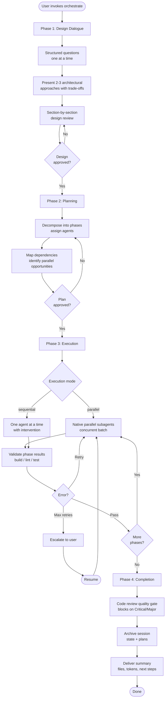
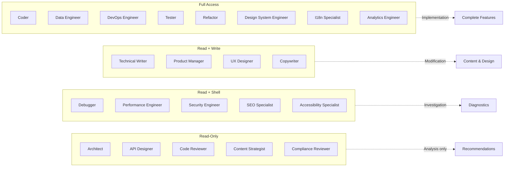

# Maestro

[](https://github.com/josstei/maestro-orchestrate/releases)
[](LICENSE)
[](https://github.com/google-gemini/gemini-cli)
[](https://docs.anthropic.com/en/docs/claude-code)

Multi-agent development orchestration platform — 22 specialists, 4-phase orchestration, native parallel subagents, persistent sessions, and standalone review/debug/security/perf/seo/a11y/compliance commands. Runs on both **Gemini CLI** and **Claude Code**.

## Table of Contents

- [Overview](#overview)
- [Features](#features)
- [Getting Started](#getting-started)
  - [Prerequisites](#prerequisites)
  - [Installation](#installation)
  - [Quick Start](#quick-start)
- [Commands](#commands)
  - [Orchestration](#orchestration)
  - [Standalone Tools](#standalone-tools)
  - [Session Management](#session-management)
- [Configuration](#configuration)
  - [Environment Variables](#environment-variables)
  - [Hooks](#hooks)
- [Architecture](#architecture)
  - [Orchestration Flow](#orchestration-flow)
  - [Component Model](#component-model)
  - [Workflow Phases](#workflow-phases)
- [Agents](#agents)
  - [Agent Roster](#agent-roster)
  - [Tool Access Philosophy](#tool-access-philosophy)
- [Skills](#skills)
- [Parallel Execution](#parallel-execution)
  - [How It Works](#how-it-works)
  - [When to Use Each Mode](#when-to-use-each-mode)
  - [Constraints](#constraints)
- [Session State & Project Output](#session-state--project-output)
- [Documentation](#documentation)
- [Troubleshooting](#troubleshooting)
- [License](#license)

## Overview

Maestro is a multi-agent orchestration platform for **Gemini CLI** and **Claude Code**. Instead of a single AI session handling everything, Maestro delegates work to 22 specialized subagents -- each with its own context, tools, and expertise -- coordinated by a TechLead orchestrator. For simple tasks, Maestro uses an Express workflow that collapses design and planning into a single brief before executing. For medium and complex tasks, Maestro follows a structured 4-phase Standard workflow: Design, Plan, Execute, Complete.

The same orchestration engine, agents, and quality gates run on both platforms. Gemini CLI uses the extension at the repo root; Claude Code uses the plugin in the `claude/` subdirectory.

Maestro classifies every task by complexity before choosing a workflow. Simple tasks (single concern, few files) get the Express path. Medium tasks (multi-component, clear boundaries) and complex tasks (cross-cutting, multi-service) enter the Standard path with full design dialogue, implementation planning, and phased execution across 22 agents spanning 8 editorial domains.

## Features

- **Express Workflow** -- Simple tasks skip ceremony: 1-2 clarifying questions, a structured brief, single-agent delegation, code review, and archival. No design document or implementation plan is created.
- **Guided Design Dialogue** -- Standard workflow includes structured requirements gathering with multiple-choice questions, depth-selectable reasoning (Quick, Standard, Deep), and architectural approach proposals with trade-offs.
- **Native Parallel Execution** -- Independent phases run concurrently through the active runtime's native subagent scheduler, batching phases at the same dependency depth with non-overlapping file ownership.
- **Session Persistence** -- All orchestration state is tracked in YAML+Markdown files with machine-readable frontmatter and human-readable logs, enabling reliable resumption after interruptions.
- **Hooks-Based Lifecycle Middleware** -- Lifecycle hooks for active-agent tracking, session context injection, and handoff validation.
- **Least-Privilege Security** -- Each subagent receives only the tools required for its role through a 4-tier access model enforced via agent frontmatter declarations.
- **Standalone Commands** -- Direct access to code review, debugging, security audit, performance analysis, SEO audit, accessibility audit, and compliance check without full orchestration.
- **8-Domain Coverage** -- Agents span Engineering, Product, Design, Content, SEO, Compliance, Internationalization, and Analytics domains, selected proportionally to task complexity.
- **MCP-First State Management** -- Session state operations use MCP tools for structured I/O and atomic transitions, with filesystem fallback when MCP is unavailable.
- **Codebase Investigation** -- Built-in codebase investigator grounds designs and plans in the actual repository structure, conventions, and integration points before proposing approaches.

## Getting Started

### Prerequisites

**Gemini CLI** requires the experimental subagent system. Claude Code users can skip to [Installation](#installation) — subagents are available by default.

Enable subagents in your Gemini CLI settings:

```json
{
  "experimental": {
    "enableAgents": true
  }
}
```

> **Warning**: Native parallel subagents currently run in autonomous mode. Sequential delegation uses your current Gemini CLI approval mode. Review the [subagents documentation](https://geminicli.com/docs/core/subagents/) for details.

The `settings.json` file is located at:
- **macOS/Linux**: `~/.gemini/settings.json`
- **Windows**: `%USERPROFILE%\.gemini\settings.json`

Maestro does not auto-edit `~/.gemini/settings.json`. Enable `experimental.enableAgents` manually before running orchestration commands.

### Installation

#### Gemini CLI

```bash
gemini extensions install https://github.com/josstei/maestro-orchestrate
```

Or for local development:

```bash
git clone https://github.com/josstei/maestro-orchestrate
cd maestro-orchestrate
gemini extensions link .
```

Verify: `gemini extensions list` should show `maestro`.

#### Claude Code

From Marketplace (recommended):

```bash
claude plugin marketplace add josstei/maestro-orchestrate
claude plugin install maestro@maestro-orchestrator --scope user
```

Development / Testing:

```bash
git clone https://github.com/josstei/maestro-orchestrate
claude --plugin-dir /path/to/maestro-orchestrate/claude
```

Marketplace install is the persistent end-user path. The `--plugin-dir` flag loads the plugin for a single session and is intended for local development or temporary testing. The Claude Code plugin lives in the `claude/` subdirectory (not the repo root).

For installation scopes and plugin management commands, see [claude/README.md](claude/README.md).

Verify: agents appear with `maestro:` prefix (e.g., `maestro:coder`), and `/orchestrate`, `/review`, etc. appear in slash-command autocomplete.

#### Command Names By Runtime

Gemini CLI exposes Maestro as `/maestro:*` commands. Claude Code exposes the same public entrypoints as top-level slash commands without the `maestro:` prefix.

| Workflow | Gemini CLI | Claude Code |
|----------|------------|-------------|
| Orchestrate | `/maestro:orchestrate` | `/orchestrate` |
| Execute | `/maestro:execute` | `/execute` |
| Resume | `/maestro:resume` | `/resume` |
| Status | `/maestro:status` | `/status` |
| Archive | `/maestro:archive` | `/archive` |
| Review | `/maestro:review` | `/review` |
| Debug | `/maestro:debug` | `/debug` |
| Security Audit | `/maestro:security-audit` | `/security-audit` |
| Performance Check | `/maestro:perf-check` | `/perf-check` |
| SEO Audit | `/maestro:seo-audit` | `/seo-audit` |
| Accessibility Audit | `/maestro:a11y-audit` | `/a11y-audit` |
| Compliance Check | `/maestro:compliance-check` | `/compliance-check` |


### Quick Start

Start a full orchestration by describing what you want to build:

```
Gemini CLI:  /maestro:orchestrate Build a REST API for a task management system with user authentication
Claude Code: /orchestrate Build a REST API for a task management system with user authentication
```

Maestro will walk you through the complete lifecycle:

1. **Design Dialogue** -- Maestro asks structured questions one at a time (problem scope, constraints, technology preferences, quality requirements, deployment context) and presents 2-3 architectural approaches with trade-offs.
2. **Design Review** -- The design document is presented section by section for your approval. Each section is 200-300 words covering requirements, architecture, component specs, team composition, risk assessment, and success criteria.
3. **Implementation Planning** -- Maestro generates a detailed plan with phase breakdown, agent assignments, dependency graph, parallel execution opportunities, and validation criteria. You review and approve before execution begins.
4. **Execution Mode Selection** -- Choose parallel dispatch (independent phases run concurrently as native subagents) or sequential delegation (one phase at a time with intervention opportunities).
5. **Phase-by-Phase Execution** -- Specialized agents implement the plan. Session state is updated after each phase with files changed, validation results, and token usage.
6. **Quality Gate** -- A final code review blocks completion on unresolved Critical or Major findings. The orchestrator remediates and re-validates until resolved.
7. **Completion & Archival** -- Maestro delivers a summary of files changed, token usage by agent, deviations from plan, and recommended next steps. The session is archived automatically.


**Express mode example** -- For straightforward tasks, Maestro detects low complexity and uses the Express workflow:

```
Gemini CLI:  /maestro:orchestrate Add a health check endpoint to the Express server
Claude Code: /orchestrate Add a health check endpoint to the Express server
```

Express mode asks 1-2 clarifying questions, presents a structured brief for approval, delegates to a single agent, runs a code review gate, and archives -- all without a full design document or implementation plan.

## Commands

| Workflow | Gemini CLI | Claude Code | Purpose |
|----------|------------|-------------|---------|
| Orchestrate | `/maestro:orchestrate` | `/orchestrate` | Full orchestration workflow (design, plan, execute, complete) |
| Execute | `/maestro:execute` | `/execute` | Execute an approved implementation plan, skipping design and planning |
| Status | `/maestro:status` | `/status` | Display current session status without modifying state |
| Resume | `/maestro:resume` | `/resume` | Resume an interrupted orchestration session |
| Archive | `/maestro:archive` | `/archive` | Archive the active session and move artifacts to archive directories |
| Review | `/maestro:review` | `/review` | Standalone code review with severity-classified findings |
| Debug | `/maestro:debug` | `/debug` | Standalone debugging session with systematic root cause analysis |
| Security Audit | `/maestro:security-audit` | `/security-audit` | Standalone security assessment (OWASP, threat modeling, data flow) |
| Performance Check | `/maestro:perf-check` | `/perf-check` | Standalone performance analysis with optimization recommendations |
| SEO Audit | `/maestro:seo-audit` | `/seo-audit` | Standalone SEO assessment (meta tags, structured data, crawlability) |
| Accessibility Audit | `/maestro:a11y-audit` | `/a11y-audit` | Standalone accessibility audit (WCAG compliance, ARIA, keyboard navigation) |
| Compliance Check | `/maestro:compliance-check` | `/compliance-check` | Standalone regulatory compliance review (GDPR/CCPA, licensing, data handling) |


### Orchestration

#### Orchestrate

Initiates the full Maestro orchestration workflow. Maestro first classifies the task by complexity, then routes to the appropriate workflow.

**Usage**:
- Gemini CLI: `/maestro:orchestrate <task description>`
- Claude Code: `/orchestrate <task description>`

**Behavior**:
1. Checks for existing active sessions in `<MAESTRO_STATE_DIR>/state/` (default: `docs/maestro/state/`)
2. If an active session exists, offers to resume or archive it
3. Classifies the task as `simple`, `medium`, or `complex`
4. Routes to the appropriate workflow:
   - **Simple tasks**: Express workflow -- clarifying questions, structured brief, single-agent delegation, code review, archival
   - **Medium/Complex tasks**: Standard 4-phase workflow -- Design Dialogue, Team Assembly & Planning, Execution, Completion

For Standard workflow, Phase 4 includes a final code reviewer quality gate that blocks completion on unresolved Critical or Major findings.

#### Execute

Executes an existing implementation plan, skipping design and planning phases.

**Usage**:
- Gemini CLI: `/maestro:execute <path-to-implementation-plan>`
- Claude Code: `/execute <path-to-implementation-plan>`

**Behavior**:
1. Reads the specified implementation plan file
2. Creates a session state file for tracking
3. Presents an execution summary for user confirmation
4. Resolves execution mode (parallel, sequential, or ask) via the execution mode gate
5. Executes phases according to the plan with full progress tracking
6. Runs a final code reviewer quality gate when execution changed non-documentation files
7. Archives the session on completion

#### Resume

Resumes an interrupted orchestration session.

**Usage**:
- Gemini CLI: `/maestro:resume`
- Claude Code: `/resume`

**Behavior**:
1. Reads active session state from `<MAESTRO_STATE_DIR>/state/active-session.md`
2. Parses session metadata and phase statuses
3. Presents a status summary with completed/pending/failed phases
4. If errors exist from the previous run, presents them and asks for guidance
5. For Express sessions: re-generates the brief or re-delegates based on phase status
6. For Standard sessions: continues execution from the last active phase using the execution and delegation skills

### Standalone Tools

#### Review

Runs a standalone code review on staged changes, last commit, or specified paths.

**Usage**:
- Gemini CLI: `/maestro:review [file paths or glob patterns]`
- Claude Code: `/review [file paths or glob patterns]`

**Behavior**:
1. Auto-detects review scope: user-specified paths > staged changes > last commit diff
2. Confirms detected scope with the user
3. Delegates to the code reviewer agent
4. Presents findings classified by severity (Critical, Major, Minor, Suggestion)
5. Every finding references a specific file and line number

#### Debug

Focused debugging session to investigate and diagnose an issue.

**Usage**:
- Gemini CLI: `/maestro:debug <issue description>`
- Claude Code: `/debug <issue description>`

**Behavior**:
1. Delegates to the debugger agent with the issue description
2. Follows systematic methodology: reproduce, hypothesize, investigate, isolate, verify
3. Presents root cause analysis with evidence, execution trace, and recommended fix

#### Security Audit

Runs a security assessment on the specified scope.

**Usage**:
- Gemini CLI: `/maestro:security-audit <scope>`
- Claude Code: `/security-audit <scope>`

**Behavior**:
1. Delegates to the security engineer agent
2. Reviews for OWASP Top 10 vulnerabilities, traces data flow, audits authentication/authorization
3. Presents findings with CVSS-aligned severity, proof of concept, and remediation steps

#### Performance Check

Runs a performance analysis on the specified scope.

**Usage**:
- Gemini CLI: `/maestro:perf-check <scope>`
- Claude Code: `/perf-check <scope>`

**Behavior**:
1. Delegates to the performance engineer agent
2. Establishes baseline, profiles hotspots, analyzes bottlenecks
3. Presents optimization recommendations ranked by impact-to-effort ratio

#### SEO Audit

Runs a technical SEO assessment on web-facing deliverables.

**Usage**:
- Gemini CLI: `/maestro:seo-audit <scope>`
- Claude Code: `/seo-audit <scope>`

**Behavior**:
1. Delegates to the SEO specialist agent
2. Reviews meta tags, structured data, crawlability, page speed factors, and canonical URLs
3. Presents findings with priority ranking and implementation guidance

#### Accessibility Audit

Runs a WCAG accessibility audit on user-facing components.

**Usage**:
- Gemini CLI: `/maestro:a11y-audit <scope>`
- Claude Code: `/a11y-audit <scope>`

**Behavior**:
1. Delegates to the accessibility specialist agent
2. Reviews WCAG 2.1 compliance, ARIA usage, keyboard navigation, color contrast, and screen reader compatibility
3. Presents findings with conformance level, impact assessment, and remediation steps

#### Compliance Check

Runs a regulatory compliance review on the specified scope.

**Usage**:
- Gemini CLI: `/maestro:compliance-check <scope>`
- Claude Code: `/compliance-check <scope>`

**Behavior**:
1. Delegates to the compliance reviewer agent
2. Reviews GDPR/CCPA data handling, license compatibility, cookie consent, and privacy policy coverage
3. Presents findings with regulatory references and remediation recommendations

### Session Management

#### Status

Displays the current orchestration session status.

**Usage**:
- Gemini CLI: `/maestro:status`
- Claude Code: `/status`

**Behavior**:
1. Reads the active session state via file injection
2. Presents phase-by-phase status, file manifest, token usage, and errors
3. Read-only -- does not modify state or continue execution

#### Archive

Archives the current active orchestration session.

**Usage**:
- Gemini CLI: `/maestro:archive`
- Claude Code: `/archive`

**Behavior**:
1. Checks for an active session
2. Presents a summary and asks for confirmation
3. For Standard sessions: moves design document, implementation plan, and session state to archive directories
4. For Express sessions: moves session state to archive (no design document or implementation plan to archive)
5. Verifies archival was successful

## Configuration

### Environment Variables

Maestro works out of the box with sensible defaults. To customize behavior, set any of these environment variables in your shell profile or project `.env` file:

| Variable | Default | Description |
|----------|---------|-------------|
| `MAESTRO_DISABLED_AGENTS` | _(none)_ | Comma-separated list of agent names to exclude from implementation planning |
| `MAESTRO_MAX_RETRIES` | `2` | Maximum retry attempts per phase before escalating to the user |
| `MAESTRO_AUTO_ARCHIVE` | `true` | Automatically archive session state on successful completion |
| `MAESTRO_VALIDATION_STRICTNESS` | `normal` | Post-phase validation strictness level (`strict`, `normal`, or `lenient`) |
| `MAESTRO_STATE_DIR` | `docs/maestro` | Base directory for session state and plans |
| `MAESTRO_MAX_CONCURRENT` | `0` | Maximum subagents emitted in one native parallel batch turn (`0` = dispatch the entire ready batch) |
| `MAESTRO_EXECUTION_MODE` | `ask` | Phase 3 execution mode: `parallel` (native concurrent subagents), `sequential` (one at a time), or `ask` (prompt each time) |


All settings are optional. The orchestrator uses the defaults shown above when a variable is not set.

Setting resolution precedence: exported env var > workspace `.env` > extension `.env` > default.

Gemini CLI only: you can configure extension-scoped settings interactively with `gemini extensions config maestro`.

### Hooks

Maestro uses lifecycle hooks for active-agent tracking, session context injection, and handoff validation. Hook events differ between runtimes:

**Gemini CLI** (`hooks/hooks.json`):

| Hook | Purpose |
|------|---------|
| SessionStart | Prune stale sessions, initialize hook state when active session exists |
| BeforeAgent | Prune stale sessions, track active agent identity, inject compact session context |
| AfterAgent | Enforce handoff report format (`Task Report` + `Downstream Context`), clear agent tracking |
| SessionEnd | Clean up hook state for ended session |

**Claude Code** (`claude/hooks/claude-hooks.json`):

| Hook | Purpose |
|------|---------|
| SessionStart | Prune stale sessions, initialize hook state |
| PreToolUse (Agent) | Track active agent identity, inject session context |
| PreToolUse (Bash) | Policy enforcement — block destructive shell commands |
| SessionEnd | Clean up hook state for ended session |

Both runtimes share canonical hook logic authored in `src/hooks/logic/`. Generated runtime files are only thin I/O adapters that resolve back into those canonical modules.

## Architecture

### Orchestration Flow




### Component Model

Maestro is built from seven primary layers plus shared resources (MCP server, templates, references). See ARCHITECTURE.md for the full nine-layer technical model. The Gemini CLI layout is at repo root; Claude Code mirrors it in `claude/` with platform-specific adaptations.

| Layer | Gemini Directory | Claude Directory | Purpose |
|-------|-----------------|-----------------|---------|
| **Orchestrator** | `GEMINI.md` | `claude/skills/orchestrate/SKILL.md` | TechLead persona, workflow routing, phase transitions, delegation rules |
| **Commands** | `commands/maestro/*.toml` | `claude/skills/*/SKILL.md` | Gemini uses TOML slash-command files; Claude exposes public skills as slash commands |
| **Agents** | `agents/*.md` | `claude/agents/*.md` | 22 subagent persona definitions with tool permissions and model config |
| **Skills** | MCP-served from `src/skills/shared/` | `claude/skills/*/SKILL.md` | Reusable methodology modules with embedded protocols |
| **Scripts** | `src/scripts/*.js` | `src/scripts/*.js` | Canonical execution infrastructure (workspace setup, state management) |
| **Hooks** | `hooks/hooks.json` | `claude/hooks/claude-hooks.json` | Lifecycle middleware for agent tracking and session context injection |
| **Policies** | `policies/maestro.toml` | `claude/scripts/policy-enforcer.js` | Safety rails for deny/ask tool access rules |

Gemini is filesystem-backed for shared MCP content. Shared methodology resources live in canonical `src/` paths, and Gemini reads them directly through the MCP tools while runtime directories keep only the discovery/config files they need on disk.

### Workflow Phases

#### Complexity Classification

Before entering any workflow, Maestro classifies the task as `simple`, `medium`, or `complex` using heuristics based on scope, example patterns, and codebase size. The classification controls workflow selection and, for Standard workflow, design depth, question coverage, section count, phase limits, and domain analysis scope.

| Signal | Simple | Medium | Complex |
|--------|--------|--------|---------|
| Scope | Single concern, few files | Multi-component, clear boundaries | Cross-cutting, multi-service |
| Examples | Static sites, config changes, single-file scripts | API endpoints, feature additions, CRUD apps | New subsystems, multi-service architectures |

The classification is presented to the user with rationale before proceeding. The user can override.

#### Express Workflow (Simple Tasks)

Express mode replaces the 4-phase Standard ceremony with a streamlined inline flow:

1. **Clarifying questions** (1-2 turns): Covers problem scope and boundaries only
2. **Structured brief** (single approval): Consolidated design+plan showing problem, approach, file manifest, agent assignment, and validation command
3. **Session creation**: Creates session with `workflow_mode: "express"` and a single phase
4. **Delegation**: Single-agent implementation with protocol injection
5. **Code review gate**: Reviews changes, blocks on Critical/Major findings (1 retry)
6. **Archival**: Archives session state (no design document or plan to archive)

#### Standard Workflow Phase 1: Design Dialogue

The TechLead engages you in a structured conversation to understand requirements:
- Presents a depth selector (Quick, Standard, Deep) to control reasoning rigour
- Uses the built-in codebase investigator to ground designs in existing repository structure when targeting an existing codebase
- Asks one question at a time, preferring multiple-choice format
- Covers problem scope, constraints, technology preferences, quality requirements, and deployment context (proportional to task complexity)
- Presents 2-3 architectural approaches with pros, cons, and recommendations
- Builds the design document section by section, validating each with you

#### Standard Workflow Phase 2: Team Assembly & Planning

After design approval, the TechLead:
- Assesses the task across all 8 capability domains (Engineering, Product, Design, Content, SEO, Compliance, Internationalization, Analytics) proportional to task complexity
- Analyzes the design for components, interfaces, and dependencies
- Assigns phases to specialized agents based on task domain
- Identifies parallel execution opportunities and dependency depths
- Generates a detailed implementation plan with validation criteria for your approval

#### Standard Workflow Phase 3: Execution

With plan approval, the TechLead:
- Resolves execution mode via the mandatory execution mode gate (parallel, sequential, or user choice)
- For parallel: dispatches independent phases as native subagent batches with non-overlapping file ownership
- For sequential: delegates one phase at a time in dependency order
- Updates session state after each phase or batch completion
- Runs post-phase validation (build, lint, tests) based on `MAESTRO_VALIDATION_STRICTNESS`
- Handles errors with up to `MAESTRO_MAX_RETRIES` automatic retries before escalating

#### Standard Workflow Phase 4: Completion

After all phases complete:
- Final code reviewer quality gate -- blocks completion on unresolved Critical/Major findings; remediates, re-validates, and re-reviews until resolved
- Session state marked as completed
- Plans and state files archived to `archive/` subdirectories (respecting `MAESTRO_AUTO_ARCHIVE`)
- Summary delivered with files changed, token usage, and next steps

## Agents

### Agent Roster

Maestro coordinates 22 specialized subagents across 8 editorial domains:

All agents share a baseline read/search/question capability set. The tool tiers below summarize effective access levels across runtimes rather than listing literal tool IDs.

| Agent | Domain | Specialization | Tool Tier |
|-------|--------|----------------|-----------|
| Architect | Engineering | System design, technology selection, component design | Read-Only |
| API Designer | Engineering | REST/GraphQL endpoint design, API contracts | Read-Only |
| Coder | Engineering | Feature implementation, clean code, SOLID principles | Full Access |
| Code Reviewer | Engineering | Code quality review, bug detection, security checks | Read-Only |
| Data Engineer | Engineering | Schema design, query optimization, ETL pipelines | Full Access |
| Debugger | Engineering | Root cause analysis, execution tracing, log analysis | Read + Shell |
| DevOps Engineer | Engineering | CI/CD pipelines, containerization, infrastructure | Full Access |
| Performance Engineer | Engineering | Profiling, bottleneck identification, optimization | Read + Shell |
| Refactor | Engineering | Code modernization, technical debt, design patterns | Full Access |
| Security Engineer | Engineering | Vulnerability assessment, OWASP, threat modeling | Read + Shell |
| Tester | Engineering | Unit/integration/E2E tests, TDD, coverage analysis | Full Access |
| Technical Writer | Engineering | API docs, READMEs, architecture documentation | Read + Write |
| Product Manager | Product | Requirements gathering, PRDs, feature prioritization | Read + Write |
| UX Designer | Design | User flow design, interaction patterns, usability evaluation | Read + Write |
| Design System Engineer | Design | Design tokens, component APIs, theming architecture | Full Access |
| Content Strategist | Content | Content planning, editorial calendars, audience targeting | Read-Only |
| Copywriter | Content | Persuasive copy, landing pages, CTAs, brand voice | Read + Write |
| SEO Specialist | SEO | Technical SEO audits, schema markup, crawlability | Read + Shell |
| Accessibility Specialist | Compliance | WCAG compliance, ARIA review, keyboard navigation | Read + Shell |
| Compliance Reviewer | Compliance | GDPR/CCPA auditing, license checks, data handling | Read-Only |
| I18n Specialist | Internationalization | String extraction, locale management, RTL support | Full Access |
| Analytics Engineer | Analytics | Event tracking, conversion funnels, A/B test design | Full Access |


### Tool Access Philosophy

Agents follow a 4-tier least-privilege model. All agents can ask clarifying questions when the active runtime allows interactive delegation; native parallel batches remain autonomous.



- **Read-Only** (Architect, API Designer, Code Reviewer, Content Strategist, Compliance Reviewer): Produce analysis, recommendations, and strategic direction. Cannot modify files or run commands.
- **Read + Shell** (Debugger, Performance Engineer, Security Engineer, SEO Specialist, Accessibility Specialist): Investigate and audit. Can run commands but not modify files directly.
- **Read + Write** (Technical Writer, Product Manager, UX Designer, Copywriter): Create and modify content and design artifacts. No shell access.
- **Full Access** (Coder, Data Engineer, DevOps Engineer, Tester, Refactor, Design System Engineer, I18n Specialist, Analytics Engineer): Complete implementation capabilities including read, write, shell, and task tracking.

## Skills

Maestro uses skills to encapsulate detailed methodologies that are loaded on demand, keeping the base context lean. In Gemini, shared methodology, templates, references, and delegation protocols are served from canonical `src/` content via the `get_skill_content` MCP tool. Runtime-local skill files are now discovery stubs where the platform requires them.

The orchestrate command's step sequence lives in `references/orchestration-steps.md` — a shared reference file loaded by both runtimes as the sole procedural authority.

In the table below, command names are shown in runtime-neutral form. Gemini CLI prefixes them with `/maestro:`; Claude Code uses the same names without that prefix.

| Skill | Purpose | Used By |
|-------|---------|---------|
| `design-dialogue` | Structured requirements gathering, depth-selectable reasoning, and architectural design convergence | `orchestrate` (Phase 1, Standard only) |
| `implementation-planning` | Phase decomposition, 8-domain agent assignment, dependency mapping, and plan generation | `orchestrate` (Phase 2, Standard only) |
| `execution` | Execution mode gate, phase execution protocols, error handling, retry logic, and completion workflows | `orchestrate` (Phase 3), `execute`, `resume` |
| `delegation` | Subagent prompt construction with protocol injection, scope boundaries, context chain construction, and downstream consumer declaration | Any phase involving subagent delegation |
| `session-management` | Session creation, state updates, resume protocol, and archival | `orchestrate`, `resume`, `archive` |
| `code-review` | Scope detection, severity classification (Critical/Major/Minor/Suggestion), and structured review output | `review`, Phase 4 quality gate |
| `validation` | Build/lint/test pipeline, project type detection, strictness gating, and result interpretation | Post-phase validation during execution |

## Parallel Execution

Maestro uses the active runtime's native subagent scheduler for parallel execution, enabling independent implementation phases to run concurrently instead of sequentially.

### How It Works

The TechLead orchestrator identifies phases at the same dependency depth with non-overlapping file ownership and dispatches them as a native parallel batch. The native scheduler only parallelizes contiguous agent tool calls, so batch turns contain agent calls exclusively -- no interleaved shell commands, file writes, or narration.

**Dispatch flow:**
1. The orchestrator identifies the ready batch from the approved implementation plan
2. Slices the batch using `MAESTRO_MAX_CONCURRENT` (`0` means dispatch the entire ready batch in one turn)
3. Marks the current chunk `in_progress` in session state and sets `current_batch`
4. Emits contiguous subagent tool calls for the chunk (agent calls only, no mixed operations)
5. Each delegation prompt includes required headers (`Agent:`, `Phase:`, `Batch:`, `Session:`) and injected protocols
6. Subagent results are parsed from `## Task Report` and `## Downstream Context` sections in the wrapped response
7. Results are persisted into session state; the orchestrator advances to the next batch or clears `current_batch` when the ready batch finishes

### When to Use Each Mode

| Use Native Parallel | Use Sequential Delegation |
|---|---|
| Phases at the same dependency depth | Phases with shared file dependencies |
| Non-overlapping file ownership | Phases that may need interactive clarification |
| Fully self-contained delegation prompts | Single-phase execution |
| Well-defined tasks with clear boundaries | Fallback when parallel execution stalls |

The execution mode gate analyzes the implementation plan and recommends a mode based on the ratio of parallelizable phases to total phases. When `MAESTRO_EXECUTION_MODE` is set to `ask` (default), the user is prompted with this recommendation. Setting it to `parallel` or `sequential` bypasses the prompt.

### Constraints

- Native parallel subagents currently run in autonomous mode (YOLO) -- all tool calls are auto-approved
- Avoid overlapping file ownership across agents in the same batch
- Each delegation prompt must be complete and self-contained -- agents cannot access results from other agents in the same batch
- If execution is interrupted, unfinished `in_progress` phases are restarted on resume rather than attempting to restore in-flight subagent dialogs
- Express workflow bypasses the execution mode gate entirely and always dispatches sequentially

## Session State & Project Output

Maestro creates the following directories in your project:

```
<your-project>/
└── docs/maestro/
    ├── plans/                          # Active design docs and implementation plans
    │   ├── archive/                    # Completed plans
    │   ├── YYYY-MM-DD-<topic>-design.md
    │   └── YYYY-MM-DD-<topic>-impl-plan.md
    └── state/                          # Session tracking
        ├── archive/                    # Completed sessions
        └── active-session.md           # Current orchestration state
```

Maestro tracks orchestration progress in `<MAESTRO_STATE_DIR>/state/active-session.md` (default: `docs/maestro/state/active-session.md`) with:

- **Phase status tracking**: pending, in_progress, completed, failed, skipped
- **File manifest**: Files created, modified, and deleted per phase
- **Error tracking**: Per-phase error logs with retry counts and resolution records
- **Token usage**: Per-agent, per-phase token consumption metrics
- **Workflow mode**: `express` or `standard`, set at session creation
- **Execution mode**: `parallel` or `sequential`, recorded after mode gate resolution (Standard only)
- **Current batch**: Active parallel batch identifier during native parallel execution

All state files use YAML frontmatter for machine-readable metadata and Markdown body for human-readable logs.

Express sessions have `workflow_mode: "express"` with `design_document: null` and `implementation_plan: null` in session state. Standard sessions include paths to both documents.

## Documentation

- **[Usage Guide](USAGE.md)** -- Comprehensive guide to installing, configuring, and using Maestro
- **[System Overview](OVERVIEW.md)** -- High-level explanation of how Maestro works, its agent system, and execution model
- **[Architecture](ARCHITECTURE.md)** — Runtime internals: hooks, MCP server, file formats, policies, and extension/plugin manifest
- **[Claude Code Plugin](claude/README.md)** — Claude Code-specific setup, commands, agent naming, and MCP tool mapping
- **Source-Of-Truth Workflow** — Edit canonical `src/`, run `npm run generate`, and validate with `node --test tests/transforms/*.test.js tests/integration/*.test.js` before committing runtime adapter changes

## Troubleshooting

### Runtime Not Loading

1. Gemini CLI: verify the extension is linked with `gemini extensions list`
2. Claude Code: start a fresh session with `claude --plugin-dir /path/to/maestro-orchestrate/claude`
3. Check that the runtime manifest exists: `gemini-extension.json` for Gemini CLI, `claude/.claude-plugin/plugin.json` for Claude Code

### Subagents Not Enabled (Gemini CLI Only)

1. Verify `experimental.enableAgents` is `true` in `~/.gemini/settings.json`
2. If the file does not exist, create it with the `experimental` section
3. Restart Gemini CLI after updating settings

Maestro does not auto-edit `~/.gemini/settings.json`; enable `experimental.enableAgents` manually.

### Session State Corrupted

1. Check the YAML frontmatter in `<MAESTRO_STATE_DIR>/state/active-session.md` for syntax errors (unmatched quotes, invalid indentation)
2. **Manual Fix**: Edit the file to fix YAML syntax
3. **Archive and Restart**: use Gemini CLI `/maestro:archive` or Claude Code `/archive`, then start fresh with Gemini CLI `/maestro:orchestrate` or Claude Code `/orchestrate`
4. **Delete State**: Remove `active-session.md` and start fresh (loses progress)

### Parallel Execution Issues

**Agents stalling or not batching correctly:**
- Check session state to verify the current batch actually started
- Look for overlapping file ownership or dependency mistakes in the implementation plan
- Check whether an agent asked a follow-up question that paused the batch

**Reducing batch problems:**
- Reduce batch size: `export MAESTRO_MAX_CONCURRENT=1`
- Fall back to sequential mode: `export MAESTRO_EXECUTION_MODE=sequential`
- Resume after tightening the plan: Gemini CLI `/maestro:resume` or Claude Code `/resume`

### Validation Failures

1. Check session state for validation error logs
2. Common causes: lint errors, test failures, build errors
3. Manually fix the issue, then rerun resume: Gemini CLI `/maestro:resume` or Claude Code `/resume`
4. Adjust strictness if needed: `export MAESTRO_VALIDATION_STRICTNESS=lenient`

### File Conflicts

1. Multiple agents tried to modify the same file during parallel execution
2. Maestro will stop and report conflict details
3. Manually resolve conflicts
4. Resume with sequential mode: `export MAESTRO_EXECUTION_MODE=sequential`, then use Gemini CLI `/maestro:resume` or Claude Code `/resume`

### Cannot Find Active Session

1. Check if `active-session.md` exists under your configured state directory (`docs/maestro/state/` by default)
2. If the file is in archive, start fresh with Gemini CLI `/maestro:orchestrate` or Claude Code `/orchestrate`
3. Check `MAESTRO_STATE_DIR` if you have customized it: `echo $MAESTRO_STATE_DIR`

### Getting Help

If you encounter issues not covered here:

1. Review session state logs in `<MAESTRO_STATE_DIR>/state/active-session.md`
2. Check Maestro version in the runtime you are using: `gemini extensions list` for Gemini CLI, or inspect the loaded plugin metadata for Claude Code
3. Review runtime logs for the environment where the issue occurs
4. Report issues on GitHub: [https://github.com/josstei/maestro-orchestrate/issues](https://github.com/josstei/maestro-orchestrate/issues)

Include: Maestro version, runtime (`Gemini CLI` or `Claude Code`) and version, session state file (redact sensitive data), error messages, and steps to reproduce.

## License

Apache-2.0
